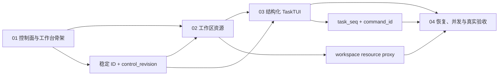

# Handoff Desktop Phase 2 Implementation Plan Index

> **For agentic workers:** REQUIRED SUB-SKILL: Use superpowers:subagent-driven-development (recommended) or superpowers:executing-plans to implement this plan task-by-task. Steps use checkbox (`- [ ]`) syntax for tracking.

**Goal:** 按四个可独立验收的 checkpoint，把 Handoff agentd 与基于 Orca 源码的桌面工作台打通，并完成设计规格中的九个真实场景。

**Architecture:** 桌面只连接本机 agentd；本机 agentd 持有项目目录、机器注册、远端连接和全局投影；所属机器 agentd 持有文件、Git、PTY、Preview、TaskFrame 与执行者事实。Orca 只提供 Electron 壳和可提取的渲染能力，Handoff 模块不得依赖 Orca SSH 或旧 Project/Worktree 持久化。

**Tech Stack:** Go 1.26、SQLite、`net/http`、coder/websocket、Electron 43、React 19、TypeScript、Zustand、Zod、xterm、Monaco、Electron `<webview>`、Vitest、Playwright。

## Global Constraints

- 设计事实源是 `docs/superpowers/specs/2026-08-09-handoff-desktop-vertical-slice-design.md`；若实现发现必须改变事实所有权、项目 Location 约束、TaskTUI 形态或远端拓扑，停止并回到设计评审，不能在代码里临时改口径。
- 所有实施都在新的隔离 worktree 完成；不得修改 `/Users/xushixin/Downloads/AnyTimeDelete/orca-main`，也不得污染主 checkout。
- Orca 上游固定为 `https://github.com/stablyai/orca` 的 annotated tag `v1.4.177-rc.0`：tag object `ff48a6d33b7bde5d37ccc367dc5aa1103d2a8ee4`，peel 后源码 commit `9e948fbdf462ede3c0160c719474100fc5cbefb7`。导入后必须保留 MIT LICENSE 与 `desktop/UPSTREAM.md`。
- 第二阶段不删除 Orca 旧业务代码；第三阶段再按依赖图瘦身。第二阶段只建立独立的 Handoff Workbench 边界和架构守卫。
- 第二阶段不实现独立任务看板、完整设置页、机器/env/执行者/审批者管理 UI、agentd 安装配对升级、高级 Git/PR/Issue 或 OpenCode 原生 TUI；机器与远端 agentd 由已有 agentd 配置预置。
- Handoff 桌面代码不得导入 Orca SSH、SFTP、SSH PTY、SSH Git、`ProjectHostSetup`、旧 Project/Worktree persistence 或原生 agent TUI 启动代码。
- Electron renderer 只拿稳定资源 ID、相对路径、公开 DTO；本机 token 和远端 secret 永不穿过 preload。
- Go 分层沿用 Handoff 现有包结构但守住 DDD 依赖方向：HTTP/peer handler 只 decode/调用 application service/encode；Store 只做持久化；领域模型与 desktop DTO 的转换统一走无状态 Assembler，禁止 handler/service 内联映射或直接查库。
- 现有 `/api/tasks`、`/ws/events` 和 CLI 行为保持兼容；桌面协议只加 `/v1`。
- 新协议的字段先以可选字段或 capability 协商演进；已发布 opcode/事件语义不可复用或静默改变。Git 命令以 Git 2.25 为基线，较新特性必须行为探测并安全回退。
- 每个代码任务先写失败测试并确认红灯，再写最小实现并确认绿灯；提交前跑该任务的聚焦测试、类型检查/静态检查，以及受影响包的回归测试。
- 每个新代码文件顶部写中文职责与边界说明；每个导出函数/类型写用途、参数、返回值和注意事项；复杂分支解释“为什么”。
- 每个关键入口、外部调用、状态变化、错误和成功结果都写结构化日志。Go 使用 `slog`；桌面主进程使用 `HandoffLogger`。日志带适用的 `machine_id`、`workspace_id`、`task_id`、`operation_id`、cursor/seq，但不得记录 token、env value、回答全文、文件内容或隐藏 reasoning。
- 禁止用 `fmt.Printf`、`print`、`console.log` 代替正式日志；renderer 的瞬时反馈使用 UI state/toast，诊断事件由 Main 进程结构化记录。
- 不以 mock 通过替代真实验收。每个计划先提供自动化 checkpoint；第四计划必须在 macOS、本机 agentd 和一台真实远端 Linux agentd 上保存可复现证据。

---

## 顺序与交付物

| 顺序 | 计划 | 主要交付 | 完成后可证明 |
|---|---|---|---|
| 1 | [01 — 控制面与工作台骨架](./2026-08-09-handoff-desktop-01-control-plane-and-workbench-shell.md) | Orca 固定快照、agentd catalog/outbox/projection、项目创建、peer 基线、bootstrap/control stream、桌面项目树 | 项目和工作区是 agentd 事实；桌面只连本机 agentd；外部 branch/worktree/task 可推送到左栏 |
| 2 | [02 — 工作区资源](./2026-08-09-handoff-desktop-02-workspace-resources.md) | 文件/Git/PTY/Preview API 与代理、右侧文件树、Monaco、xterm、Browser、Workspace 标签与分屏 | 本地与远端目录都能浏览、编辑、开终端、分屏和预览，且切换 Workspace 不串状态 |
| 3 | [03 — 结构化 TaskTUI](./2026-08-09-handoff-desktop-03-structured-task-tui.md) | 六类 TaskFrame、recorder/artifact、snapshot/replay、幂等命令、统一 TaskTUI | OpenCode/Claude/Grok 统一成同一桌面 TUI；审批、回答、继续、停止不走 PTY |
| 4 | [04 — 恢复、并发与真实验收](./2026-08-09-handoff-desktop-04-resilience-and-acceptance.md) | capability/兼容、cursor reset、断线恢复、多桌面冲突、九场景证据、macOS 包 | 真实远端断线/重连、多实例审批和完整纵切达到第二阶段完成门槛 |

## 设计规格覆盖矩阵

| 设计规格 | 实施任务 | 覆盖结论 |
|---|---|---|
| §§1–3 目标、核心决策与范围 | Index Global Constraints；01 T1；04 T7/T10 | 单仓库导入固定 Orca；第二阶段不做看板/完整设置/机器管理/Orca 瘦身/原生 OpenCode TUI |
| §4 三栏工作台、Workspace 标签与断线界面 | 01 T9/T10；02 T7–T10；03 T8/T9 | 左树、中间四类标签/左右分屏、右文件树按同一 Workspace 联动；断线保留元数据但现场不可用 |
| §5 事实边界与唯一连接拓扑 | 01 T2–T8；02 T1/T6；03 T2–T4/T7 | Desktop 只连 local agentd；local control plane 与 owner Machine Authority 分责；handler→application service→repository 分层且 renderer 不持久化业务事实 |
| §6 Machine/Project/Location/Workspace/GitRef/Task/Event 模型 | 01 T2–T6；03 T1–T4 | 稳定 ID、detached 归并、三条单调序列、稀疏 CLI Event 与高频 TaskFrame 分流均有迁移和事务测试 |
| §7 项目创建与 durable Operation | 01 T5/T7–T10 | local `0..1` + remote `0..1` + total `>=1`；Finder 仅本机；clone 默认目录、部分成功和幂等重试完整覆盖 |
| §8 worktree/branch/task 推送 | 01 T4/T6/T10；04 T3/T9 | owner outbox、watch-triggered Reconcile、peer catch-up、全局投影和断线漏差修复形成闭环 |
| §9 Desktop 协议 | 01 T6–T8；02 T1–T6；03 T2/T4/T7；04 T1/T2 | bootstrap/control、task session/frame、command、file/Git/PTY/Preview 均有版本、cursor、Problem 与跨语言契约 |
| §10 统一结构化 TaskTUI | 03 T1–T10 | 六类 frame、artifact、三 adapter 归一化、reasoning 过滤、权威交互与无 PTY UI 全覆盖 |
| §11 Orca 改造边界 | 01 T1/T8/T9；02 T7–T9；03 T9；04 T6/T7 | 复用纯 xterm/Monaco/Browser/split surface；Handoff feature 不接 Orca SSH、旧业务 store 或原生 agent launch |
| §12 失败与恢复 | 01 T6/T9；02 T2/T4/T5/T9；04 T1–T3/T5 | 五态 Machine、严格恢复阶段、cursor reset、PTY incarnation、资源不可用和多桌面 canonical conflict 均可验证 |
| §13 安全边界 | 01 T8；02 T1/T2/T5/T6；04 T4/T6 | token/secret 不过 preload；owner 端 path 授权；TLS/private-mode、Preview SSRF 与日志脱敏 fail-closed |
| §14 可观测性与容量 | 所有任务的日志/注释步骤；03 T2；04 T2/T6 | 关键入口/外调/状态/错误/成功均结构化记录；frame batching、artifact、retention 和慢客户端边界有容量测试 |
| §15 兼容与迁移 | 01 T2/T3/T6；04 T1/T2/T7 | 保留旧 CLI wire/Task 字段；幂等 DB 迁移；mixed-version capability；Orca 旧代码保留到第三阶段 |
| §16 测试策略 | 01–03 T10；04 T1–T8/T10 | Go/SQLite/race、Go↔TS golden、fake wire、Electron E2E、package smoke 与架构守卫逐层验证 |
| §17 九个完成门槛 | 04 T8/T9/T10 | 九个固定 scenario ID 同时要求自动化版本和真实 macOS/local+remote/OpenCode 证据 |
| §18 实施硬边界 | Index Global Constraints；各计划 Interfaces/Completion Gate；04 T6/T10 | 顺序 checkpoint、独立模块、先提纯 surface、逐任务日志/注释、不得第二阶段瘦身均变成执行门禁 |

## Checkpoint 依赖

## 每个计划的进入条件

### 进入计划 01

- 设计规格已确认。
- 当前 Handoff Go 测试全绿。
- 官方 Orca tag/commit 可读取。

### 进入计划 02

- `GET /v1/bootstrap` 与 `WS /v1/control/stream` 已有无窗口丢失测试。
- Project、Location、Workspace、Machine、TaskSummary 均有稳定 ID 和持久化约束。
- 桌面 CatalogStore 能从 fake agentd 重建左栏。

### 进入计划 03

- 文件、Git、PTY、Preview 都只能经本机 agentd 调用。
- 当前 Workspace 能稳定驱动中栏标签组和右栏文件根。
- xterm/Monaco/Browser surface 已与 Orca 旧业务 store 解耦到足够被 Handoff 注入 transport。

### 进入计划 04

- 六类 TaskFrame、snapshot/replay 和 command API 的自动测试全绿。
- 真实 OpenCode 单任务闭环在本机已跑通。
- Claude Code 与 Grok fixture 能归一化为同一 reducer 输入。

## 第二阶段最终完成定义

- `go test ./...` 通过。
- `cd desktop && pnpm typecheck && pnpm test` 通过。
- Handoff 新增/改动文件通过 Orca changed-code quality、max-lines ratchet 和架构导入守卫。
- macOS 打包、安装、启动 smoke 通过，renderer 无 page error，主进程无未处理 rejection。
- 设计规格 §17 的九个场景都有：步骤、版本/commit、关键命令、结构化日志筛选条件、截图或录屏、数据库/进程事实和结论。
- `rg` 守卫证明 Handoff feature 不含 Orca SSH/旧 Project/Worktree 依赖，TaskTUI 不创建 PTY，不存在 OpenCode 原生 TUI 桌面入口。
- 第二阶段完成提交已接受独立的规格审阅与代码质量审阅；所有 P0/P1 反馈已解决。
