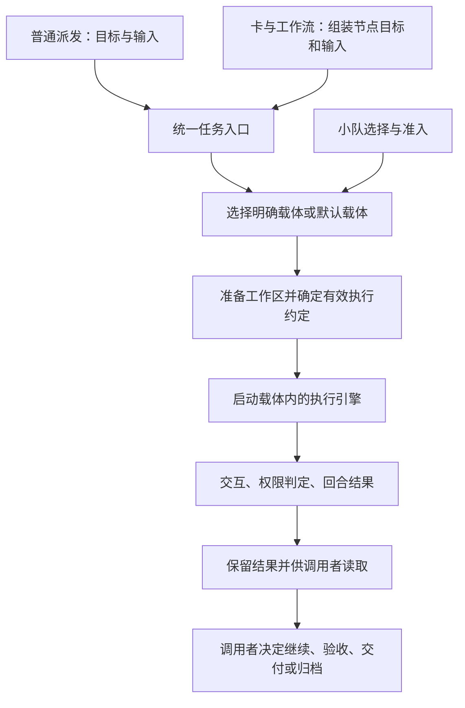

# 从一次任务派发整理 Handoff 的基础模型

日期：2026-09-06。状态：现状调查与产品模型草案，尚未冻结实现契约。最新优先级：首次配置暂缓，先整理跨机访问、审批 client、harness 分能力契约及 HOME 供给等核心基础边界。

## 1. 本轮要解决什么

先让一次任务派发有清楚的执行约定：做什么、在哪里做、用哪个运行环境、允许什么、遇到什么要审批、收到哪些指令、最后留下什么。再沿着这条链确定子系统和领域的责任。

工作流是使用这些能力的上层应用。后续“spec 确定后由协调者自主推进”需要建立在这条基础链之上。

**用户已确认：所有派发统一通过载体，支持默认载体。** 普通派发不要求先建卡、配置工作流或小队；默认载体让这个入口保持简单。小队最终也必须选出载体，不能另行拼接机器、执行器和 HOME。

其余内容均为调查结论或设计建议，下文明确区分。尚未修改实现、运行配置或架构目标图。

## 2. 当前基础究竟到了哪里

已有可复用的任务执行能力：项目与工作区准备、执行引擎适配、持久化任务、提问与权限交互、回合结束、继续、恢复、归档。问题集中在这些能力之间缺少统一的任务约定，而且上层入口仍参与决定底层行为。

| 问题 | 当前实现事实 | 对整理基础的影响 |
| --- | --- | --- |
| 普通派发与载体 | 普通派发传 target、executor、model、HOME；基础派发请求和 Task 没有载体身份。小队准入接在卡节点路径上 | “使用载体”还不是所有任务共同的不变量 |
| 小队选出的究竟是什么 | 先选 online 载体、按该载体计数，再以请求覆盖机器、执行器、模型 | 已计费的容量与实际执行落点可能不一致；这是源码推导的风险，未派真实任务复现 |
| 纪律是什么 | 角色文本、平台文本、固定回合协议共同进入执行上下文；还有模板正文 | 同一条规则可能由多处表达；文本约束不能证明权限已受控 |
| 权限是否统一 | 引擎原生配置先处理一部分请求；到达 Handoff 的请求再走静态判定、模型审批或升级审批 | Handoff 的判定器并非所有动作的共同入口 |
| 协调者权限 | task run 接口执行 shell，不经过执行者审批门；当前工作流 push 使用这个接口 | “协调者能做”与“任务授权允许”还不是同一个模型 |
| 产物交付 | 有分支/commit 回合结果、附件引用、节点产出路径检查和当前源码中的推送逻辑 | 回合结束、附件挂上、结果可取回、已发布、已验收不能互相替代 |
| 工作流自动化 | 节点 runner 执行单节点；另有坐席、唤醒、协调者恢复等机制 | 不足以据此声称 spec 后能无人接管地完成整条开发流程 |

证据入口：[普通派发](/Users/xushixin/workspace/handoff/cmd/dispatch.go:182)、[基础请求](/Users/xushixin/workspace/handoff/internal/client/client.go:717)、[Task](/Users/xushixin/workspace/handoff/internal/proto/proto.go:223)、[任务调配](/Users/xushixin/workspace/handoff/internal/agentd/manager.go:691)、[小队准入](/Users/xushixin/workspace/handoff/internal/scheduling/scheduling.go:604)、[覆盖落点](/Users/xushixin/workspace/handoff/internal/scheduling/scheduling.go:728)、[卡节点准入](/Users/xushixin/workspace/handoff/internal/agentd/scheddispatch.go:47)。

部署边界也要说准确：当前 agentd 启动时必须打开账本，并装配自动化。普通任务“不挂卡”不等于当前可以关闭账本运行。整理目标首先是解除业务依赖；共用数据库、共用进程本身不构成领域混乱。[启动装配](/Users/xushixin/workspace/handoff/cmd/agentd.go:452)

## 3. 先把几个名词拆清楚

下表是建议的产品含义，不是已经落地的新类型。

| 名词 | 回答的问题 | 应承担的责任 |
| --- | --- | --- |
| 任务 | 这次委托是什么？ | 保存目标、输入、有效执行约定、交互和结果；拥有任务生命周期 |
| 回合 | 执行者这次回应到哪一步？ | 表达提问、执行失败或本轮结果；一次任务可以有多个回合 |
| 执行引擎 | 如何驱动 Codex、Claude、OpenCode 等程序？ | 启停、发送消息、接收事件、映射原生权限和结果协议；现有 executor adapter 向这一层收敛 |
| 载体 | 用哪套可用的运行环境执行？ | 包装机器、引擎、HOME/凭据来源及相关运行设置，提供可识别的执行入口 |
| 小队 | 从哪些载体中分配资源？ | 维护候选集合、选择和容量约束；输出一个实际载体 |
| 工作区 | 这次任务能访问和修改哪里？ | 项目、基线、目录、隔离、Git 状态和保留/回收 |
| 执行纪律 | 希望执行者怎样完成任务？ | 工作方法、验证要求、汇报要求等可读指导 |
| 权限策略 | 哪个主体被允许执行什么动作？ | 确定自动允许、拒绝或等待审批，记录授权来源与适用范围 |
| 协调者 | 谁组织任务、回答问题、判断下一步？ | 使用基础能力推进应用目标；拥有明确授权的调用者身份 |
| 工作流 | 多个任务与人工步骤怎样组成业务过程？ | 节点、依赖、轮次、路由、业务验收、任务与卡的关联 |

建议把“执行者”从与载体并列的可配置资源，下沉为载体内部的引擎实现。用户仍能在载体配置、任务详情和诊断中看见所用引擎；隐藏底层选择不应损失可解释性。

“协调者/实现者/审查者”表达职责，“载体”表达运行环境，两者不应互相替代。当前小队存在 executor/coordinator 两种角色，这个限制是否保留，需要结合两条驱动协议的兼容性单独判断；载体统一不自动意味着两种小队现在就能混用。

## 4. 一次派发应该怎么走

用一个最小例子贯穿：**在指定项目中，让默认载体修复一个已说明的问题，运行约定验证，交回代码结果。** 是否允许 push 是独立交付选择，尚待确认。

建议的责任顺序：

1. **调用者说明委托。** 普通派发提交任务输入；工作流把卡、节点、前序结果转成同类输入。基础任务不解释“implement 列”“卡是否可移动”。
2. **解析载体并准入。** 显式载体或默认载体走同一规则；小队提供选择策略。实际启动的环境必须与计入容量的载体一致。
3. **确定本次有效约定。** 合并任务目标、载体运行设置、工作区范围、纪律、权限和结果要求，保存实际生效值及来源。禁止在之后某个入口静默改写环境或扩大权限。
4. **准备并启动。** 工作区能力处理基线与隔离；引擎适配器翻译已经确定的约定，不自行决定卡业务或重新选择纪律。
5. **处理过程中的交互。** 回合提问、操作审批、引擎故障分别表达。继续和恢复沿用本任务约定；需要变更时留下明确变更记录。
6. **接收并保留结果。** 记录执行者声明和系统能够核实的事实。调用者可以继续、交付或归档；清理前应满足已约定的结果保留条件。

第一步要统一的是这一条行为链，而不是先把全仓库搬进一套新目录。

## 5. 纪律保留什么，如何注入

### 当前注入路径

- 普通派发默认只有平台纪律；可用 discipline-file 提交一次性文本。
- 卡模板/节点派发解析命名纪律；解析后把正文、名称、版本传给任务。平台正文由 Compose 包住角色正文。
- Manager 在启动前保存 discipline.md；适配器把纪律与固定回合协议、任务正文一起交给模型。Codex 还使用常驻 developer instructions。恢复路径读取任务已保存的纪律。
- 旧的映射配置接口仍能保存数据，但其运行时消费者已退役，不能以“配置有值”推断生效。

证据：[解析纪律](/Users/xushixin/workspace/handoff/internal/discipline/dispatch.go:65)、[平台组装](/Users/xushixin/workspace/handoff/internal/discipline/platform.go:26)、[固定协议与 prompt](/Users/xushixin/workspace/handoff/internal/executor/turn/protocol.go:40)、[废弃映射说明](/Users/xushixin/workspace/handoff/internal/agentd/discipline.go:185)。

本会话读到的账本配置还有具体冲突：charter-default v5 对只读审查要求 summary-only，但当前固定回合协议仍要求 branch、commit、summary。工作流版本固定，也不代表未来节点使用的模板和纪律版本全部固定；模板通过 GetTemplate(name, 0) 取最新版，纪律也存在按名称取最新版的路径。

### 建议

**保留执行纪律，赋予它清楚的文本职责。** “先核实再汇报”“如何审查”“需要哪些验证”适合纪律；“禁止写文件”“不能 push”“不能再派发”需要对应权限控制，不能仅凭纪律保证。

基础层统一组装执行上下文：执行协议、有效权限的说明、选定纪律、任务输入。工作流只选择纪律并提供业务输入，避免再写一套平台铁律或收尾协议。一个任务保存确定版本与正文，恢复时复用。

同一规则只保留一个权威来源。例如 push 是否允许由权限/交付设置决定，再生成对应文字；固定协议与模板不能分别作相反要求。用户应能查看本任务实际收到的完整指令以及来源。

这不要求现在建立复杂的规则语言或插件体系。先统一已有文本的职责、组装点和快照，便可消除已观察到的冲突。

## 6. 权限当前怎么运转，统一应指什么

### 当前的多层判定

| 层次 | 当前行为 |
| --- | --- |
| 引擎原生权限 | 不同适配器配置不同。OpenCode 默认 bash/edit 有大量直接允许；Claude 有 allow/ask 列表；Codex 使用工作区沙箱与 on-request。原生已放行的动作不会再等 Handoff 审批 |
| 静态判定器 | 对到达 Handoff 的请求判断截断、路径范围、黑名单、命令白名单；范围内 write/edit 可自动允许，越界或黑名单升级审批，未明确判定的命令可转模型 |
| 模型审批 | 参考任务摘要与操作请求，返回允许或升级审批；错误、超时或不可用时升级。它不是执行纪律全文的硬性解释器 |
| 决策复用 | 同任务、相同指纹、已送达的 allow 可复用；当前查询未限定必须来自人工审批 |
| 升级审批 | 由后续审批响应作决定；静态 Gate 自身主要给出 AutoAllow、Consult、Escalate，不是完整 allow/deny/ask 授权模型 |
| 协调者命令 | task run 不走上述门；虽有调用鉴权，但鉴权成功不等于某个任务动作获得授权 |

证据：[静态判定](/Users/xushixin/workspace/handoff/internal/permgate/permgate.go:159)、[权限调配](/Users/xushixin/workspace/handoff/internal/agentd/manager.go:1840)、[审批模型](/Users/xushixin/workspace/handoff/internal/agentd/manager.go:2135)、[授权复用](/Users/xushixin/workspace/handoff/internal/store/store.go:1155)、[协调者命令入口](/Users/xushixin/workspace/handoff/internal/agentd/server.go:1999)。

因此，当前“只读审查”主要是文本和部分后置检查的语义，不能据此声称所有引擎都在操作发生前禁止写入。强推命中黑名单也不等于普通 push 被统一禁止。

### 建议的配置与判定关系

统一的是**政策来源、动作语义和授权记录**。协调者、执行者和人工可以拥有不同授权，不能因换入口就跳过任务范围的判断。

建议配置关系为：平台规则确定可委托边界，项目设置提供默认策略，任务选择本次授权，临时审批只作用于所批准的动作和范围。小队不授予权限，载体提供执行能力及其限制。合并时区分“默认值”与“不可越过的上限”，避免一张简单的覆盖优先级表把权限越合越大。

需要区分的动作至少包括：读、写、运行命令、网络访问、本地提交、远端推送、再次派发。它们不是同一个“危险程度”开关。具体默认允许/询问/禁止表需要逐项确定，不能从现有命令白名单直接当作产品政策继承。

先确定授权，再处理具体操作；审批模型只能在允许委托给它的范围内作判断，不能扩大上限。引擎适配器负责把同一策略映射到其原生机制；若某引擎做不到要求的限制，应明确报告能力差距，不能显示成同等保证。该能力矩阵需要后续真实执行验证。

## 7. 最小结果与交付边界

当前具有部分结果机制，尚未组成可靠的交付闭环：

- 回合协议携带 branch、commit、summary；只读任务可以引用当前 HEAD，没有新提交。
- 卡附件主要是 kind/path 引用；AttachFile 本身不核验文件。节点 produced 检查要求路径出现在本轮改动集合，但“改动集合包含路径”不足以证明该文件最终存在且可被下一步读取。
- 当前源码在节点 pass 后，通过任务 run 推分支到 origin；已发布记录按卡和分支判断，没有记录被发布的准确 commit，不能直接代表该分支的每次新提交都已交付。
- Manager 收到回合结果后进入 waiting_review；Done 再归档并清理 managed worktree。这两个动作都不自动证明业务验收完成。

证据：[附件类型](/Users/xushixin/workspace/handoff/internal/ledger/types.go:107)、[挂附件](/Users/xushixin/workspace/handoff/internal/ledger/cards.go:466)、[节点检查和发布](/Users/xushixin/workspace/handoff/internal/ledgerstep/node.go:400)、[发布记录](/Users/xushixin/workspace/handoff/internal/ledger/events.go:513)、[实际 push 调用](/Users/xushixin/workspace/handoff/internal/agentd/cardstep.go:174)、[归档](/Users/xushixin/workspace/handoff/internal/agentd/manager.go:1450)。

建议先补清最低责任：任务结果说明本轮结论及证据；代码结果关联准确仓库、分支和 commit；文件结果可定位并验证可读取；清理遵守结果保留约定。业务是否接受结果，由普通派发调用者或工作流决定。

push 是独立交付动作，其负责主体与默认授权仍待用户确认。若由平台执行，应让普通派发与工作流共用同一能力；若由执行者执行，也应受同一任务授权模型控制。无需为此立即建设通用产物平台。

## 8. 顺着任务链得到的责任地图

这是候选责任归属，覆盖现有目标图的 15 个根，供下一步逐项对账；不宣称每一行都必须成为独立服务，也不要求已有根名原样保留。

| 候选责任 | 内部需要梳理的领域 | 对应现有根/实现线索 | 边界 |
| --- | --- | --- | --- |
| 任务执行调配 | 派发约定、任务状态、回合、提问、恢复、结果与归档 | d_orchestration；Manager、store | 不解释卡列、节点 verdict、业务验收 |
| 执行资源调度 | 载体、小队选择、容量准入、排队与释放 | d_scheduling；scheduling、scheddispatch | 不拼接节点 prompt，不覆盖已选载体的物理身份；卡状态由应用判断 |
| 项目与工作区 | 项目定位、基线、隔离、Git 操作、结果留存与清理 | d_workspace；workspace.go | 不决定业务 pass，也不自行授予 push 权限 |
| 执行策略 | 权限规则与审批、纪律解析与组装 | d_policy；permgate、discipline、taskenv | 两套不同语义分别建模；配置文件是载体，不是业务责任边界 |
| 执行引擎适配 | 原生程序生命周期、协议、权限映射、能力报告 | d_execution；executor、hostapi driver | 消费有效执行约定；执行任务与协调者驱动是否共享实现另行验证 |
| 交互会话 | PTY、连接、输出回放 | d_sessions | 会话断开或退出不自行裁定任务业务完成 |
| 跨机访问与协议 | 目标访问、转发、连接错误、线协议 | d_transport、d_protocol | 传递明确契约，不新增一套调度或授权语义 |
| 卡与工作流应用 | 卡、依赖、模板、节点、轮次、路由、业务验收、结果关联 | d_ledger；ledger、ledgerstep | 组装任务输入并消费结果，调用共享派发/交付能力 |
| 自主协调应用 | 坐席、触发、上下文恢复、下一步判断、人工接管 | d_keystone | 使用卡应用与基础任务服务；不能凭协调者身份绕过授权 |
| 协作通信 | 房间、消息、收件箱、协作事件 | d_collab | 提供通信事实；是否推进节点由应用决定 |
| 产品入口 | HTTP/WS 鉴权路由、CLI、Web 展示与操作 | d_gateway、d_cli、d_web | 同一能力使用同一应用契约，不各自实现覆盖顺序 |
| 运行维护 | 安装、升级、服务生命周期 | d_maintenance | 管系统运行，不持有任务或工作流的业务裁决 |

目前分布式组装已有具体例子：scheddispatch 的 effectiveCovers 注释要求与 ledgerstep 保持规则副本同步；scheduling 的 IgnitionRequest 又携带 Card、Node、Ready。这些应作为跨界核查入口。[覆盖规则副本](/Users/xushixin/workspace/handoff/internal/agentd/scheddispatch.go:108)、[调度请求](/Users/xushixin/workspace/handoff/internal/scheduling/scheduling.go:122)

领域是否升格成子系统，继续按其独立规则、状态所有权、对外能力与变化原因判断。目录大小和已有名称只作线索。

## 9. 第一个可执行的线头

**按用户最新指示，首次配置与自动发现暂缓。** 当前先做基础能力的责任与契约梳理，详细见[基础设施边界草案](/Users/xushixin/workspace/handoff/docs/superpowers/specs/2026-09-06-foundation-infrastructure-boundaries-draft.md)。下列载体选择、准入、绑定目标继续保留，作为基础能力确定后的上层消费验收，不再以初始化改造作为前置步骤。

预期行为是：同一个普通任务，显式选载体或使用默认载体，最终都得到确定的载体绑定；通过小队派发时也得到同样的绑定。任务能解释本次用了哪个载体及其有效环境，容量限制约束实际启动的那个环境。

这段后续实现的验收应覆盖：

- 普通派发不建卡、不配置工作流也能使用默认载体；没有有效默认值时给出可操作的错误，不暗中回退到裸环境。
- 显式载体、小队选择、默认选择进入同一套载体校验与容量约束；工作流只额外提供应用输入和调度选择。
- 选中载体后不能把机器、引擎或 HOME 偷换成另一套；模型是否允许逐任务覆盖，作为明确的运行参数规则单独定稿。
- Task 保存载体身份与本次有效设置；事后修改载体配置不会让历史任务的解释跟着变化。
- 启动失败、取消、恢复、节点失败不会留下重复占位或提前释放正在使用的容量；释放责任由实际执行占用决定。

这是一段行为目标，不是已批准的实现 plan。默认载体的配置作用域、历史裸派发参数的迁移、容量占用的生命周期，还需要在该切片 spec 中定清。

当前建议先以“一个执行会话使用注入的审批 client”为贯穿场景，明确 harness 与审批的契约，归拢原生适配知识，再收敛跨机调用和工作区支持。之后才把载体、小队、派发、工作流接到这些基础能力上。顺序是设计建议，尚未冻结实现 plan。

## 10. 决策与证据状态

已确认：统一通过载体，支持默认载体。

待确定：push 责任与授权；默认载体配置作用域；任务权限的默认表和上限；模型覆盖规则；结果保留期限及归档条件。本草案对纪律、权限和领域归属的建议尚待讨论，不把它们包装成已获批准的规则。

本会话曾读取本地 CLI/agentd 报告为 4e633e9a674a+dirty4，工作区源码 HEAD 为 86a08861。账本读取和源码分析已区分；特别是当前源码中的发布逻辑，不能直接断言已在运行二进制中验证。

本轮为文档与静态调查，没有派发探针任务或更改运行配置。前一轮四个相关 Go 包测试通过，只能证明当时这些包的测试结果，不能替代原生引擎权限、跨机交付或自主推进的行为验收。

取证过程与工作区保护记录见[调查台账](/Users/xushixin/workspace/handoff/docs/superpowers/ledgers/2026-09-06-foundation-domain-model-ledger.md)。

## 11. 首次使用：恢复简单派发，再按需要配置

状态：用户已明确暂缓此项。保留讨论内容供未来使用，不属于当前基础设施整理的实施范围。

### 当前分裂点

`init` 探测本机引擎后，填写机器角色、默认执行者、模型、监听、项目根目录、审批引擎和同步选项，结果写入 config.yaml。CLI 与桌面初次向导已经共用 initflow.Form，因此它们并非两套独立问答规则。但这套共同规则仍以 executor.default 为中心，没有接到载体登记上。

载体另由 scheduling 的登记能力持有，控制台又要求填写名称、机器、CLI、HOME、凭据来源等。当前检测的顺序实际是 opencode、claude、grok、codex、agy 五种，部分注释和表单说明仍写“四家”。

证据：[init 调用链](/Users/xushixin/workspace/handoff/cmd/init.go:46)、[表单字段](/Users/xushixin/workspace/handoff/internal/initflow/form.go:201)、[桌面复用](/Users/xushixin/workspace/handoff/desktop/internal/shell/wizard.go:22)、[引擎发现](/Users/xushixin/workspace/handoff/internal/toolchain/detect.go:118)、[载体登记](/Users/xushixin/workspace/handoff/internal/scheduling/scheduling.go:191)。

这说明需要统一初始化与日常配置所操作的产品对象，而不仅是将原向导的全部问题搬进 skill。

### 建议的默认体验

“每个引擎的基础载体”和“省略接收者时的默认载体”是两件事。发现三个引擎，可以有三个基础载体，但默认选择只能有一个。

1. 首次使用、显式刷新或已启用的本机发现发现新引擎时，按机器、引擎、HOME 对应的运行档案复用或建立基础载体。默认沿用本机已有主 HOME；独立账号、隔离 HOME 留给确实需要它的人。
2. 本地发现只证明程序及部分凭据线索存在。没有完成相应可用性验证时，载体明确显示待验证/需登录等事实；不因登记成功而显示可执行。验证方式及是否消耗模型额度必须可说明。
3. 已有默认值保持不变。首次只有一个已验证可用的载体时可设为默认；有多个时问一次用户偏好。用户在当前使用请求中已明确指定某引擎/载体，就沿用该意图，不重复问同一个选择。
4. 后续发现新引擎只增加可选资源，不改变默认、不自动加入部门、不授予更多权限。重复发现保持幂等；用户已删除或停用的自动发现项不能在下一次刷新时被悄悄恢复。
5. 本机简单任务不要求先决定“协调者机/执行机”、远端配对、部门、审批模型或工作流。遇到确实需要这些能力的使用场景，再补相应配置。

这组规则是建议，尚未批准。自动创建仅针对受支持、受管理范围内的引擎发现，不扩大成扫描机器上所有账号或凭据。

### setup skill 的位置

建议移除阻塞首次使用的整套长向导，保留程序提供的确定性发现、校验、登记和配置接口。setup skill 成为主要的对话配置助手：读取当前事实，只询问无法推导的选择，展示生效结果，调用这些接口完成配置，并验证是否可派发。

这样 CLI、桌面、skill 共用一份配置事实。skill 不自己复制规则、不直接拼接多份互不校验的配置，也不成为运行系统必须依赖的解释器。模型不可用时，用户仍能通过简短命令或设置页完成同样的配置。

Matt Pocock 的 setup skill 提供了可借鉴的交互模式：先读现状，逐项补齐必要决策，将配置交给后续技能消费。它配置的是仓库的 issue tracker、标签和领域文档；Handoff 的进程、凭据、载体等运行配置仍需要程序校验。这里借鉴其交互方式，未安装或执行该外部 skill。[官方 skill 源码](https://github.com/mattpocock/skills/blob/main/skills/engineering/setup-matt-pocock-skills/SKILL.md)

## 12. 派发名称：用户只说明交给谁

赞成载体与小队在**同一个 Handoff 资源登记范围**内共用唯一名称。比如“交给小王”和“交给研发部”使用同一接收者入口，系统从登记信息识别它是载体还是小队；用户无需额外指定类型。

内部仍保留类型与稳定引用。载体走直接准入，小队先选择成员，最终都绑定实际载体。对外少一个选项不意味着内部可以猜类型；也不需要创造一个带完整生命周期的新“接收者实体”，统一查询与命名约束即可。

| 情况 | 建议行为 |
| --- | --- |
| 显式给出名称 | 唯一解析为载体或小队，再走各自选择/准入逻辑 |
| 未给名称 | 使用已确认的默认载体；此轮不另加“默认部门”的配置概念 |
| 自动生成名称被占用 | 先按运行档案身份查重；不同资源使用确定性后缀，并展示生成后的名字 |
| 手动登记冲突 | 拒绝并说明现有同名对象，不采用“载体优先”或“小队优先” |
| 旧数据已有重名 | 保留已有有类型的引用；要求消除冲突后才能用无类型名称派发，不猜测或静默改绑 |
| 并发登记同名 | 命名占用需统一、原子地约束，不能仅靠两个页面各自查重 |

当前实现用 carrier/squad 两种存储 kind，PutCarrier 与 PutSquad 没有跨类型查重；因此这是一项新规则，不能宣称现状已经支持。[两种登记入口](/Users/xushixin/workspace/handoff/internal/scheduling/scheduling.go:339)

## 13. 用公司结构解释产品

认可公司结构作为主要解释方式。它能把资源、委托、授权和业务流程串成一个用户熟悉的模型。

| 公司说法 | Handoff 对象 | 需要说清的含义 |
| --- | --- | --- |
| 董事长 | 用户/最终授权人 | 确定目标、授权边界和保留给人的决策 |
| CEO | 当前协调者 | 在授权范围内组织工作、调度、跟进与收口；不是默认拥有所有机器权限 |
| 部门 | 小队 | 一组可分配的员工，具有成员选择和容量规则；部门本身不执行任务 |
| 员工 | 载体 | 一份可派活的员工档案，封装运行环境和能力；具体一次上岗是任务中的执行会话 |
| 员工使用的专业工具 | 执行引擎及模型 | 决定如何工作，配置在载体内部；不要求董事长每次单独组装 |
| 岗位/本次职责 | 协调、实现、审查等任务角色 | 说明这次负责什么；不等同于机器、引擎或载体身份 |
| 委托单 | 任务 | 目标、输入、边界、结果要求、当前进度 |
| 项目台账 | 卡及依赖 | 记录业务事项及其与任务的关系 |
| 公司工作流程 | 工作流 | 委托单与人工步骤的组织方式 |
| 规章制度/作业手册 | 执行纪律 | 告诉员工怎样工作、验证和汇报 |
| 授权制度与门禁 | 权限策略及执行控制 | 决定实际允许哪些动作；读过制度不等于系统已控制住动作 |
| 工位与项目资料 | 工作区、基线、输入 | 员工本次工作的范围与起点 |
| 工作报告与交付 | 回合结果、可读取产物、发布记录 | 区分“员工说做完了”“公司接收了”“已对外交付” |

比喻需要保留三条真实边界：

- **员工档案不自动代表持续记忆。** 当前载体主要包装环境，不能暗示它会记住所有历史任务。若将来需要长期身份、经历和记忆，那是新的产品能力。
- **部门是资源编组。** 同一载体可以属于多个小队，不能从公司比喻推导必须有唯一上级、部门经理或额外审批层。部门容量与员工容量仍要统一计算。
- **CEO 是职责，不是权限豁免。** 由 Handoff 拉起的协调者也应有载体与授权；当前会话中的外部协调者是调用者，不因这个比喻就自动成为已登记载体或获得平台外权限。

## 14. 流程图如何阅读

详细图集见[基础任务与公司运作流程图](/Users/xushixin/workspace/handoff/docs/superpowers/specs/2026-09-06-foundation-process-atlas.md)。图集提供：总体脉络、首次使用、名称解析与准入、指令组装、操作权限、任务回合与恢复、结果交付、工作流消费基础能力。

这些图展示建议的目标行为，包括错误、审批、继续和人工接管分支；不是当前实现图，也不代表对应代码已完成。push 的负责主体仍使用待决分支表达。

## 15. 当前焦点：基础能力与上层领域分开

跨机访问、审批 client、harness 的执行/协调/一次性调用/环境管理接口，以及 HOME 供给的归属，转到[基础设施边界草案](/Users/xushixin/workspace/handoff/docs/superpowers/specs/2026-09-06-foundation-infrastructure-boundaries-draft.md)集中讨论。审批包含自己的政策和决策事实；载体、小队、任务也有各自领域规则，不将它们全部压成无规则的“应用层”。工作流继续是消费这些核心能力的上层应用。
