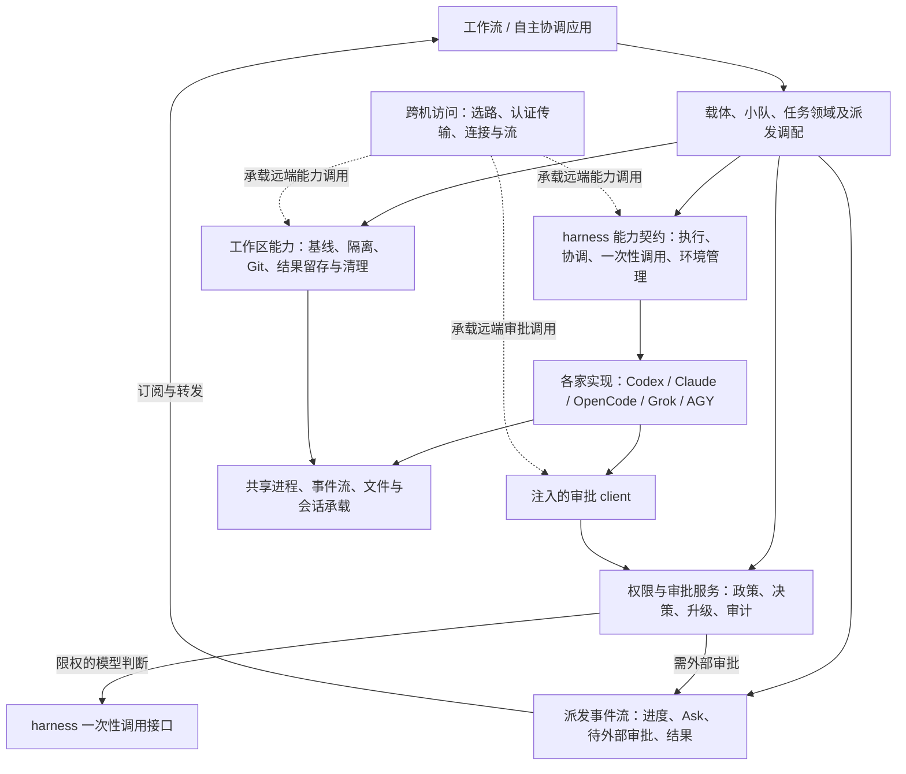
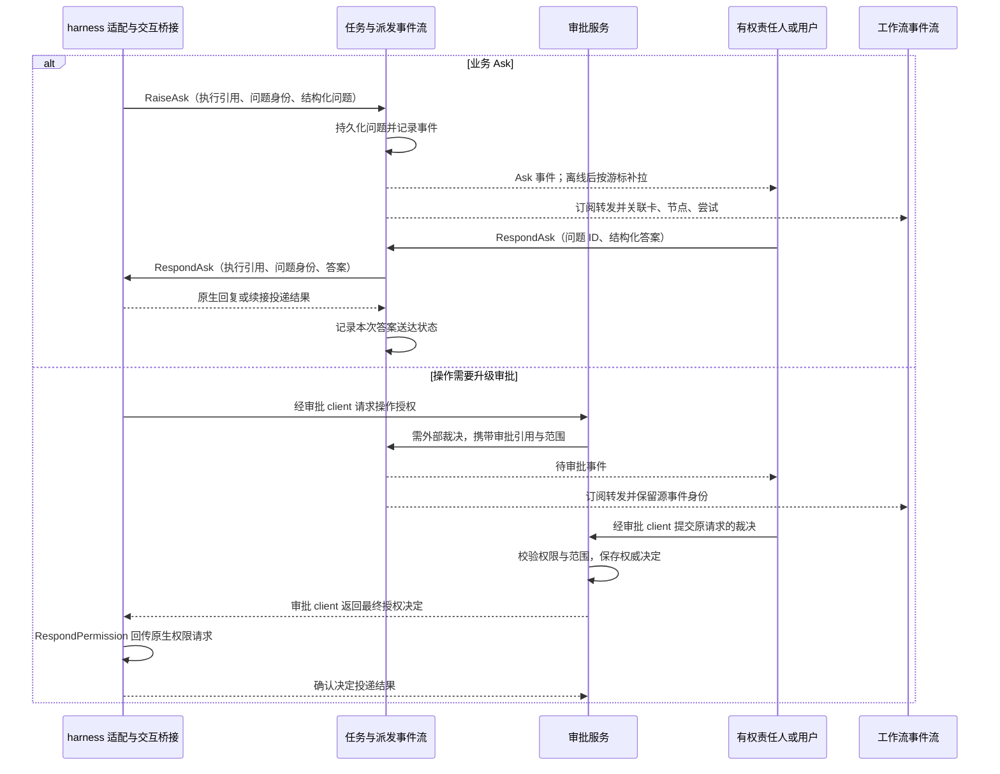

# Handoff 基础能力边界：跨机、审批、harness 与工作区

日期：2026-09-06。状态：基于源码核查的架构讨论草案，方法名表达能力意图，尚未冻结 Go 签名或实施计划。

本轮按用户指示暂缓初次配置，聚焦核心。上层产品模型见[基础模型](/Users/xushixin/workspace/handoff/docs/superpowers/specs/2026-09-06-foundation-domain-model-draft.md)。

## 1. 建议的边界

用户提出的三条主线成立：跨机访问统一承载；审批以可注入 client 提供；harness 按能力提供接口并在各自包中实现。

还需明确工作区/Git 能力、派发事件流中的 Ask 与审批升级，以及 harness 下面已有的进程/会话承载能力。2026-09-06 用户已确认通过派发事件流上浮交互、审批仍由 client 处理；不增加独立交互领域或第三条事件总线。精确接口及各迁移卡的完整 spec 尚未冻结。

图表示能力关系，不是一条初始化调用链。审批服务调用一次性模型时使用自身受限配置，不能把被审批任务的权限转交给审批模型，也不能形成模型审批自己的递归调用。

## 2. 跨机访问：底座较集中，外围仍混业务

### 可以保留的底座

- targetclient.New 集中决定直连还是 relay；Pool 复用连接并在配置变化时失效重建。
- relay 承担隧道、流复用、端到端传输等通信责任。
- 隧道预热与目标服务可达分开；通用请求转发不盲目重试写请求。

这些已有明确边界，不能仅因外层杂糅就判定整套跨机机制需要重写。[选路工厂](/Users/xushixin/workspace/handoff/internal/targetclient/targetclient.go:36)、[连接池](/Users/xushixin/workspace/handoff/internal/targetclient/pool.go:114)、[预热](/Users/xushixin/workspace/handoff/internal/targetclient/warm.go:1)

### 应收回上层的规则

| 已核实的代码 | 当前混入的责任 | 建议归属 |
| --- | --- | --- |
| agentd.forwardWorktreeIfRequested | 转发前摘 card_ids，远端建树后在本地挂卡并改写结果 | 卡应用编排远端工作区调用与本地账本写入 |
| client.isDeliverable | 判断审批审计、progress 等哪些事件应唤醒协调者 | 任务事件消费策略；基础流只负责按契约可靠交付 |
| internal/client 的整体接口 | 同一个大 client 汇集任务、卡、工作区、机器、PTY 等 API | 各能力提供明确 client，共用底层传输；可保留兼容聚合门面 |
| 部分上层取 HTTPClient 后自行拼请求 | 调用者重新掌握传输细节，能力边界容易继续扩散 | 用能力 client 封装，只有传输/网关组装处接触原始 HTTP |

证据：[建树专用转发](/Users/xushixin/workspace/handoff/internal/agentd/forward.go:160)、[事件过滤](/Users/xushixin/workspace/handoff/internal/client/client.go:140)、[聚合 client](/Users/xushixin/workspace/handoff/internal/client/client.go:180)。

目标边界为：传输知道目标机、连接、认证、超时、取消、重连和字节/事件流；能力 client 知道调用哪种能力；应用知道为什么调用以及调用后推进什么业务。网络认证与某任务操作授权分开。

本轮没有运行直连/relay 真机验证，因此“较集中”是结构判断，不是连通性或协议安全验收结论。

## 3. 审批：注入 client，harness 不决定升级路径

### 当前结构与迁移方向

现在 adapter 发出 permission 事件，Manager 负责静态门、审批模型、升级、工单和决策回传；免审规则分散在各家 taskenv。审批模型的 argv 在 executor.OneShotArgs，进程执行又在 agentd.Approver。

方向应是：审批服务拥有政策及决策事实；执行实例获得限定于自身身份和范围的 client。harness 负责原生权限翻译与决定投递，Manager 只消费必要的状态事件，不再自己实现一套审批链。

### client 的最小能力

| 能力意图 | 入参与结果 | 边界 |
| --- | --- | --- |
| 取得有效政策 PolicySnapshot | 绑定的执行身份/范围 → 版本、可免审规则、明确禁止项、其余动作的审批要求 | 不让 harness 自行扩大范围 |
| 请求审批 Request | 稳定原生请求 ID、完整动作、资源与上下文 → 审批引用及当前决定 | 服务负责静态判断、默认审批者、升级与去重 |
| 等待决定 Await | 审批引用与取消上下文 → 允许/拒绝及范围、理由 | client 处理等待和恢复；harness 不选择找谁审批 |
| 确认投递 Acknowledge | 审批引用、原生请求 ID、投递结果 | 区分决定已形成、已送达、动作已执行 |

这些不是必须暴露给每个 adapter 的四次手动调用：共享桥接可以提供 Authorize 便利方法。底层保留审批引用，使重启恢复和异步等待不依赖一个永远活着的函数栈。业务事件泵不能被某一项长时间审批阻塞。

harness 不需要 ChooseApprover、EscalateToHuman 或 ApproveByModel 这类方法。审批记录由审批域唯一写入，任务状态仍由任务域唯一写入；彼此通过事件或返回结果关联。

### 免审配置的关键约束

同一有效政策只解析一次，各 harness 把其中能够精确表达的部分编译成原生规则。无法精确表达的允许条件送审批 client，不用更宽的原生 allow 代替。明确禁止项直接实施；无法实施所需边界时报告能力不足。

免审并非意味着来源不明的预置白名单。配置必须能追溯到同一政策版本；运行中修改上限时，需明确会话重新配置或失效策略。具体热更新形式留待契约阶段确定。

权限 callback 到达后：标准化原生请求 → 调用 client → 接收最终决定 → 翻译并送回 harness。审批成功不等于操作已成功。

证据：[现有 adapter 契约](/Users/xushixin/workspace/handoff/internal/executor/executor.go:219)、[Manager 审批入口](/Users/xushixin/workspace/handoff/internal/agentd/manager.go:1840)、[审批一次性执行](/Users/xushixin/workspace/handoff/internal/agentd/approver.go:156)。

## 4. harness：按能力给接口，按厂商收实现

### 当前知识分散在哪里

- 执行任务已有 Adapter.Start/Events/Send/RespondPermission/Stop；恢复等扩展接口有一部分由 Manager 内部通过类型断言发现。
- 协调者承载另在 hostapi.driver，仅实装 OpenCode；调用者通过 keysclient.Runner 的 Launch/Resume 使用。
- 一次性调用在 executor.OneShotArgs 的厂商 switch；其“grok 一次性 = low effort”等策略将调用用途与原生能力混在了一起。
- skill 安装在独立路径表中维护各家目录；协调者 HOME 的规则复制又直接写 OpenCode 的路径。

证据：[协调者驱动](/Users/xushixin/workspace/handoff/internal/hostapi/driver.go:50)、[协调者调用面](/Users/xushixin/workspace/handoff/internal/keysclient/keysclient.go:43)、[一次性参数映射](/Users/xushixin/workspace/handoff/internal/executor/oneshot.go:25)、[恢复接口](/Users/xushixin/workspace/handoff/internal/agentd/manager.go:3504)、[skill 路径表](/Users/xushixin/workspace/handoff/internal/skill/install.go:51)。

### 候选能力接口

| 能力接口 | 最小方法意图 | 明确不承担 |
| --- | --- | --- |
| 执行会话 Executor | Start、Events、Send、Stop；支持时提供 Recover；交互另有 RespondAsk | 卡状态、业务验收、审批者选择、资源调度 |
| 协调会话 Coordinator | Launch、Resume、CancelTurn；支持时提供 AttachInfo；产生问题时同样使用 RespondAsk | 卡下一步怎么走、何时唤醒、CEO 拥有哪些业务权力 |
| 一次性调用 OneShot | Invoke，输入运行设置、文本及所需限制，返回文本、用量与执行状态；context 控制取消 | 硬编码“所有一次性调用都必须廉价”、审批结果语义解析 |
| HOME/配置管理 Profile | Inspect、Prepare、Verify；管理指定范围的全局规则与原生配置 | 选择员工、选择角色、决定装哪些制度或复制谁的账号 |
| skill 管理 Skills | Inspect、Install/Update；明确授权时 Remove | 决定协调者或实现者应装哪些业务 skill |

契约由能力提供方统一拥有，各家包实现它支持的能力；上层消费对应接口。不要求每家实现全部能力，也不以“都有一个 CLI”推导它们都支持协调、恢复、一次性无工具执行等。

“执行者接口/协调者接口”可以是面向调用者的不同能力视图。如果两种场景真正共享同一种会话机制，就复用底层 Session 驱动，不复制一套流程；如果生命周期或协议不同，就分别实现。差异通过能力信息与明确错误表达。

### 可以共享和不能下沉的部分

可共享：进程启动与终止、上下文取消、输出边界、通用事件运输、权限桥接、文件原子写入、受管配置更新。

各家保留：argv、原生 API/SSE/JSONL 结构、权限配置语法、登录态判据、会话恢复格式、规则文件位置和 skill 目录。

任务层保留：任务纪律选择与快照、提问/结果业务协议、branch/commit/verdict 的任务语义。通用 harness 可以交回原生文本和事件，不应各自解释工作流验收。已有共用的回合协议实现可以在任务执行包装层复用。

## 5. 隔离 HOME：载体持有需求，harness 实施供给

不是把全部逻辑放到其中一边。合理分工为：

| 责任 | 所属 |
| --- | --- |
| 哪个载体使用哪个 HOME、是否隔离、凭据来源、期望规则与 skills | 载体领域及其应用操作 |
| 某种职责需要哪些规则与 skills、可访问哪些产品能力 | 上层角色配置与授权；提交为明确的供给输入 |
| 各家 HOME 内部目录、配置语法、全局规则文件与 skill 安装方式 | 对应 harness 的 Profile/Skills 实现 |
| 在哪台机器执行准备与验证 | 跨机能力 client 选择目标；实际路径由目标机解释 |
| 受管文件写入、清单比对与可复用复制机制 | harness 下的共享文件组件 |

执行链：载体提交期望环境 → 目标机 harness 检查已有环境 → 应用明确的配置与安装变更 → 返回实际供给/验证结果 → 载体记录状态。登记成功、文件写成、引擎能启动和满足权限要求是不同事实。

**载体全局规则与单任务指令分开。** 任务临时纪律和授权不应反复覆盖载体的全局规则；否则同一载体并发执行两项任务会互相污染。全局规则是受管环境的一部分，任务设置通过会话配置或任务目录覆盖。

现状中 coordinatorHomeSupplier.Prepare 同时投影 Handoff 活配置、供给凭据和复制规则；copyCoordinatorRules 固定使用 `.config/opencode`，skill.Install 则按另一张厂商表写入。前者的产品配置投影应由协调应用给出，原生路径知识应回到 harness；凭据供给按载体声明的策略执行，不复制会话库或整个 HOME。[HOME 供给](/Users/xushixin/workspace/handoff/internal/agentd/coordinator_home.go:33)、[OpenCode 规则复制](/Users/xushixin/workspace/handoff/internal/agentd/coordinator_home.go:221)

## 6. 还需要哪些基础能力

**工作区/Git 必须有自己的清楚能力面。** 项目基线解析、创建或复用工作区、读取文件和 diff、定位准确 commit、传输代码以及清理，是普通任务和工作流都会使用的能力。决定接受哪个业务结果、是否授权 push，仍在上层。现有实现可从 PrepareWorkspace、ResolveBaseline、DiffRange 拆清。[工作区入口](/Users/xushixin/workspace/handoff/internal/agentd/workspace.go:418)

**进程和会话承载也需要明确，但无需新增一排顶层服务。** 进程树终止、PTY、输出流、重连、原生会话引用，作为 harness 和远端执行使用的支持能力。它们不拥有任务是否完成或卡是否通过的事实。

存储、日志、事件投递等是这些领域的技术支持。没有必要把所有技术名词都升级成独立产品领域。

审批本身拥有政策、授权和审批状态，因此是可复用的核心领域服务，通过 client 消费；称它为基础能力可以，但不能因此把这些规则放进一个无边界的 util 包。

## 7. 再上层如何组织

载体、小队、任务不能统称成只做编排的应用层：

- 载体拥有运行档案与期望配置，小队拥有选择与容量规则。
- 任务拥有执行约定、状态、回合与结果；派发是协调这些领域和基础能力的应用操作。
- 工作流拥有节点、依赖、路由与业务验收；自主协调应用决定何时继续、何时找人。

可以采用“基础能力 → 核心领域与派发调配 → 工作流/自主协调应用”的三层产品结构。物理目录与进程如何拆不在此刻先定。

## 8. 当前第一个贯穿场景

建议用**一个执行会话取得政策快照、配置原生免审规则、对其他动作调用审批 client，收到决定后继续**来检验边界。先以已有一个 harness 的真实实现说明全部契约，再用另一家不同的权限机制检查是否把第一家的细节误当通用接口。

这一场景同时给出：审批服务的权威事实、client 生命周期、harness 的能力和限制、会话事件与任务事件的关系。它不需要先改初次配置或接入完整工作流，也不意味着先移动目录再补接口。

下一阶段需冻结的仍是行为：批准/拒绝/待定与投递失败如何表达；哪些原生免审映射可兑现；配置快照怎样绑定运行；恢复后怎样避免重复审批或重复动作。精确签名和代码迁移在这些边界确定后进行。

本轮只做源码阅读与文档更新，没有执行远端命令、创建 HOME、安装业务 skills、修改审批配置或运行真实 harness。

## 9. 已确认：Ask 与审批升级通过派发事件流上浮

### Ask 的定义

Ask 是执行会话因缺少事实、业务选择或委托边界，向本次委托的决策责任人提出的**有身份、需要回答的请求**。例如“兼容旧格式还是仅支持新格式”。它不是普通进度消息，不是操作权限申请，也不是任务完成。

问题必须保留结构：请求身份、执行实例与回合、问题正文、问题项 ID、候选项及单选/多选/自由输入要求。原生没有问题 ID 时，在首次识别该问题时生成并保存；重放复用该身份，不能每收到相同帧就新建请求。

需要该答案的执行等待回答，不得把无回答当成选了默认项。暂停原生工具还是结束当前回合等待下一回合，是适配机制差异。无法确保等待语义时应报告能力限制，不把“工具解阻塞”当成“业务问题已解决”。

### 统一上浮的最小能力

派发返回执行引用和可订阅事件流。Ask、待外部审批、进度、结果和失败都由这条事件流通知监听者，不增设 InteractionService。问题与答案由任务领域保存，授权请求与决定由审批领域保存；事件流传递这些事实及其稳定引用。

| 交互类型 | 谁发起 | 谁决定送给谁 | 谁拥有语义与最终事实 |
| --- | --- | --- | --- |
| Ask | 执行者或协调者会话 | 委托关系中的责任人及其委托规则；超出职责时上浮给用户 | 任务领域持有问题、答案与投递状态 |
| 审批升级 | 审批服务 | 审批政策确定有权处理的主体；可为协调者或用户 | 审批服务接收外部裁决，校验并形成权威授权决定 |

事件携带执行、回合、请求身份和所需上下文；业务答案与批准/拒绝使用不同响应入口。审批路由不能因“CEO 在线”就把本应由用户授权的事项交给 CEO 批准。

任务问答保留待答、已答未投递、已送达及取消/失效状态。审批服务分别记录决定形成与原生请求投递结果。审批链无法自行作出有效决定、或政策要求外部裁决时发布待审批事件；不把网络故障、拒绝或超时一律解释成允许升级后放行。

上浮采用**持久化请求 + 可恢复派发事件流**：先落请求，再通知订阅者；消费者重连后按游标补拉，并核对待答请求。通知失败不能让问题消失，不能只靠内存 waiter 保存唯一事实。跨机由共用传输承载命令调用和事件订阅，不另建交互协议栈。

工作流在派发产生事件流后订阅并转发，补充卡、节点、尝试及源事件身份；同时发布自己的工作流业务事件。源任务及审批状态不复制成工作流的第二套权威事实。游标推进、重复事件与失联恢复在迁移卡 spec 中定清。

协调者需要再问用户时，保持原请求及其上浮关联，不复制成一张失去原回程身份的新问题。调度小队不自动成为回答问题的责任人。

### 上浮与返回

订阅负责上浮，响应仍是有类型的调用：Ask 回到执行引用的 RespondAsk，审批裁决回到审批 client。二者检查请求身份、回答者权限及当前状态，不用普通 Send 代替。

### 回答是否使用 Send

**上层不使用无关联的 Send 来回答待决请求。** 三个语义分开：

| 方法意图 | 用途 | 必须关联 |
| --- | --- | --- |
| Send | 新的普通消息、补充指令或继续工作的输入 | 执行实例；按会话状态明确处理，不能偷偷消费任意挂起问题 |
| RespondAsk | 回答一项明确的问题 | 执行实例、回合/尝试、问题 ID、结构化答案 |
| RespondPermission | 把审批服务形成的决定投递给原生操作请求 | 执行实例、权限请求 ID、决定与授权范围 |

RespondPermission 是审批桥接到原生驱动的能力，不是给任意上层调用者绕过审批服务的入口。RespondAsk 可以由执行会话与协调会话共用的交互能力提供。

RespondAsk 内部有两种合法实现：

- 原生问题仍挂起：调用该问题的原生回复接口，不开新回合。
- 问题来自已结束回合的提问协议：核对待答身份后，以带明确关联的答案开启后续回合。底层可以复用发送 prompt 的机制，但不能丢掉“这是对哪次提问的回答”的语义。

审批结果必须解除或拒绝原生权限请求。把“允许”通过 Send 发给模型，通常不会回答正在挂起的工具请求，也不能代替授权记录。拒绝后的解释性消息如确需另发，只能作为附属指导，不能冒充新的 Ask 答案。

### 恢复与过期回答

回答要通过 request ID 回到原执行与问题，不能只按 task ID 找“当前待答问题”。重复相同回答幂等处理；竞争回答通过版本或状态约束解决；原会话已取消、请求失效或已换尝试时，不把迟到答案喂给新会话。

投递失败保留“已答但未送达”；恢复时核对原生请求是否仍存在。原生不支持幂等回复且送达结果不确定时，先对账，不能宣称通用的恰好一次执行。一个会话是否支持多个挂起问题由能力声明，不通过单一内存槽隐式假定。

Ask 答案本身不自动扩大操作权限。如果答案包含明确授权，可由审批服务验证回答者和具体范围后转为授权，无需为了系统分层再重复询问用户。

### 当前代码事实

- Manager.handleQuestion 创建 ask 工单并发布 question 事件；waitQuestion 等待回答，然后调用 Adapter.Send。权限回传则是 RespondPermission。
- OpenCode.Send 内部检查 pendingQuestionID：有问题时走 ReplyQuestion，否则 PromptAsync。这是同名接口隐藏两种语义的具体证据。
- Codex 当前原生提问回调先回复“转交协调者并结束回合”的指令；Grok 当前回复 skip_interview，再上报问题。这是现有适配选择，不能据此断言原生协议必须采用该方式。
- Manager 当前拒绝理由补发逻辑会优先消费下一次提问，注释明确不区分兜底提问和真实提问。新契约应使用明确请求关联，不以“下一条问题”充当投递地址。

证据：[Ask 建单](/Users/xushixin/workspace/handoff/internal/agentd/manager.go:2751)、[Ask 回传](/Users/xushixin/workspace/handoff/internal/agentd/manager.go:2836)、[OpenCode Send](/Users/xushixin/workspace/handoff/internal/executor/opencode/adapter.go:529)、[Codex 提问桥接](/Users/xushixin/workspace/handoff/internal/executor/codex/question.go:1)、[Grok 提问桥接](/Users/xushixin/workspace/handoff/internal/executor/grok/adapter.go:1215)。

这些是源码观察，尚未对原生问题挂起、重启后答复和多问题并发做本轮真实 harness 验收。
