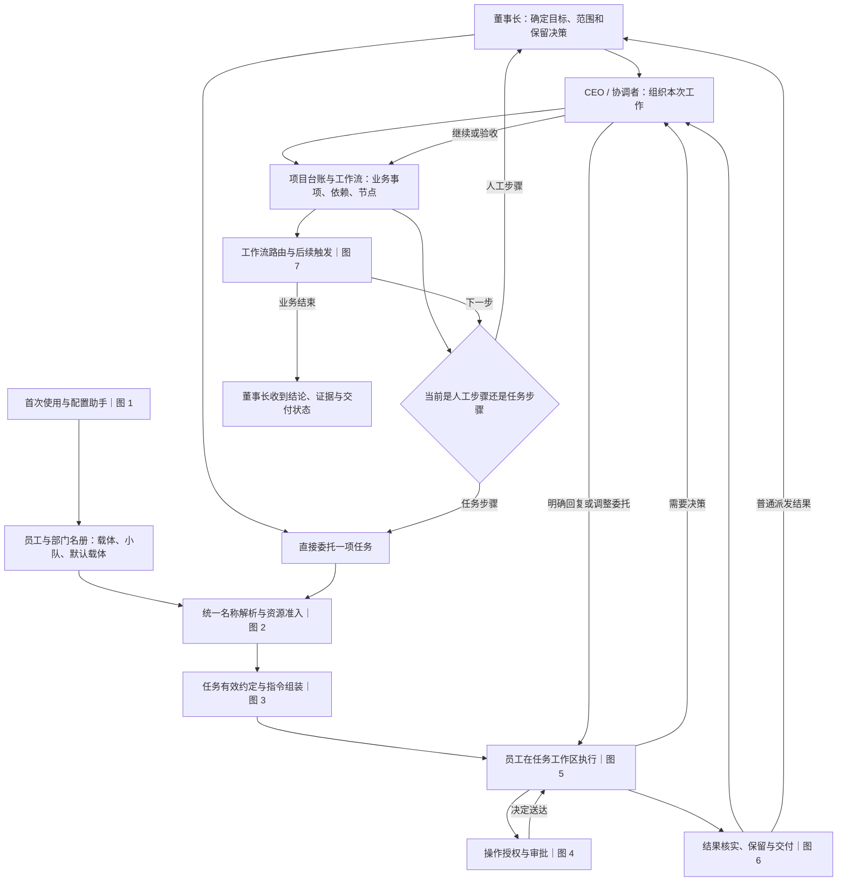
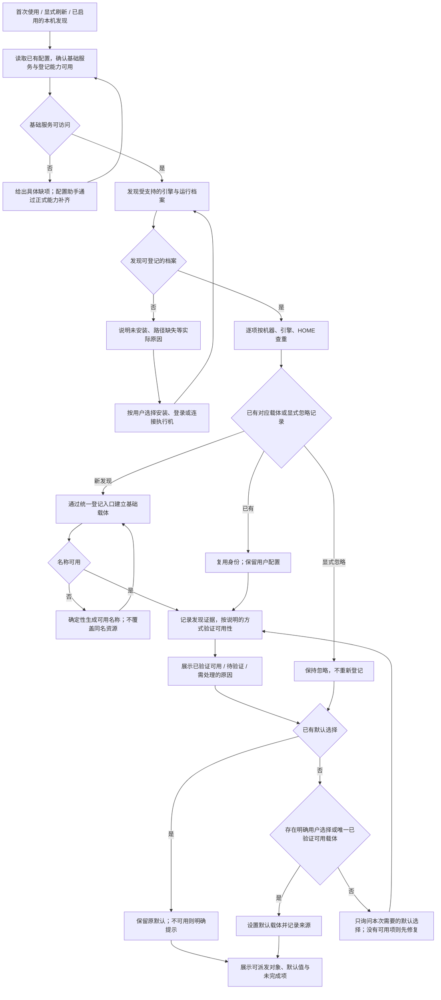
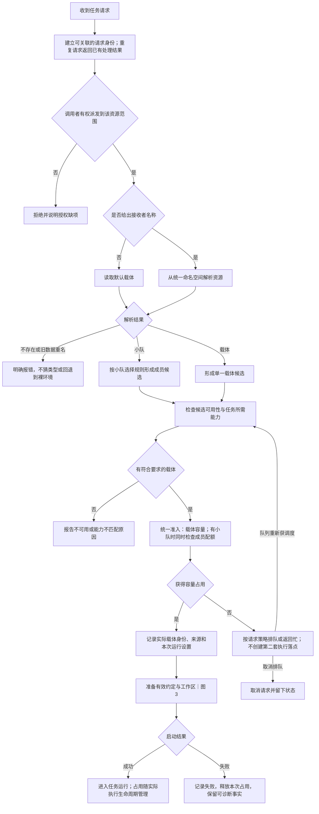
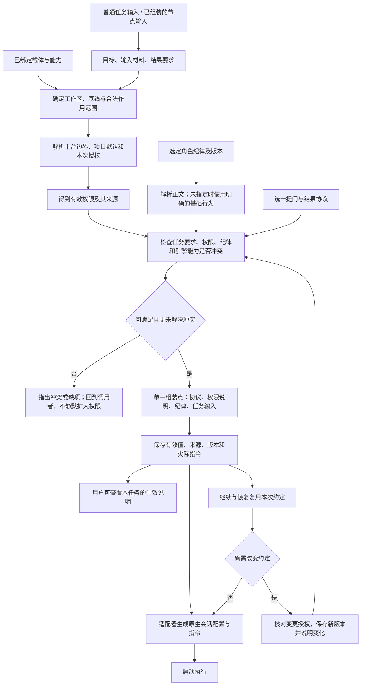
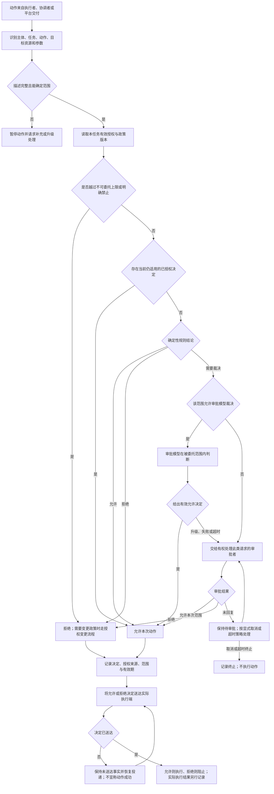
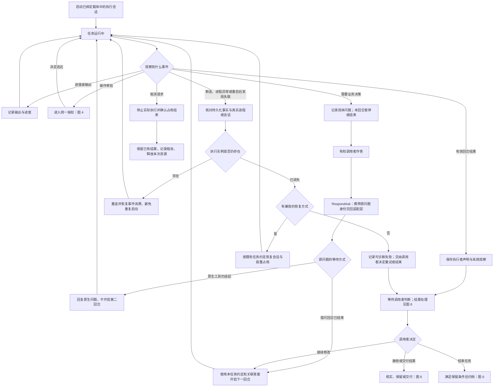
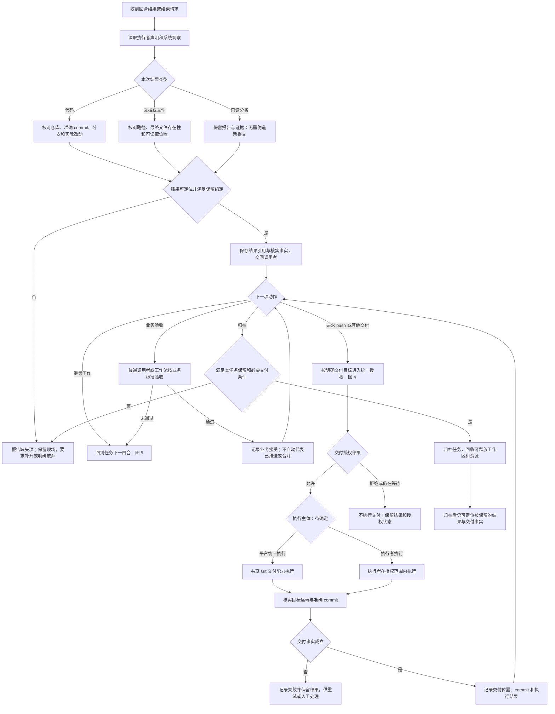
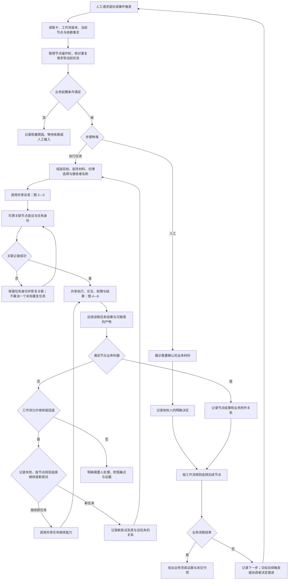

# Handoff 基础任务与公司运作流程图

日期：2026-09-06。配套：[基础模型草案](/Users/xushixin/workspace/handoff/docs/superpowers/specs/2026-09-06-foundation-domain-model-draft.md)。

**阅读边界：这是建议的目标流程。** 已确认的是“统一通过载体，支持默认载体”。自动建载体、统一名称等是本轮新增建议；权限默认表与 push 归属仍待确定。图中的行为顺序不等于已冻结的函数签名、事务方案或现有代码。

最新范围调整：用户已明确将首次配置暂缓，图 1 保留供后续讨论，不作为当前实现入口。当前基础能力关系与审批 client/harness 分工见[基础设施边界草案](/Users/xushixin/workspace/handoff/docs/superpowers/specs/2026-09-06-foundation-infrastructure-boundaries-draft.md)。

先看图 0 的整体，再按编号进入领域细节。每张图标出责任、输入、输出和异常去向；领域细节服从同一任务事实，不各建一套任务状态机。

## 图 0：整体脉络——公司如何接活与交回结果

部门把任务分配给具体员工；部门本身不是执行环境。CEO 代表协调职责，可以来自外部调用，也可以由平台拉起；平台内拉起时同样需要载体与明确授权。这里没有新增“部门经理”实体。

## 图 1：首次使用、发现新引擎与配置

责任：运行维护建立基础运行条件；资源域持有载体登记与默认选择；setup skill、CLI、设置页是同一配置能力的入口。

图中“逐项”处理完发现集合后再确定默认值，不能每发现一个就抢占默认。基本档案默认沿用主 HOME，不自动复制凭据或建立小队。多引擎只需一次偏好选择；新发现不改旧默认。待验证不是“已上线”，引擎可启动也不证明已满足任务的全部权限限制。

setup skill 可处理复杂配置与修复；日常简单派发无需每次重跑它。它展示并调用程序提供的配置能力，不成为另一份配置事实。

## 图 2：交给谁——统一名称解析、准入与绑定

输入：任务目标与输入、可选接收者名称、调用者身份。输出：任务关联的实际载体绑定与容量占用。工作流就绪条件在进入此图前由应用判断。

待定实现细节包括：队列是否默认启用、预约如何持久化及恢复、取消与启动竞态怎样解决。必须守住的行为是：已选载体、实际启动环境和容量计数一致；重复请求不启动两份；恢复不重复计数。工作流可以提供优先级等调度输入，但调度域无需读取卡的具体状态。

## 图 3：告诉员工什么——任务约定与指令组装

责任：任务调配记录有效约定，工作区域提供范围与基线，策略域确定权限和纪律，引擎适配器翻译已确定内容。

纪律正文可以版本化复用，权限必须有可执行语义；两者不能用同一段文字互相冒充。原生引擎不能实施所需限制时，返回能力不匹配。具体如何证明原生适配一致，需要后续行为测试。

## 图 4：员工或 CEO 要做一个动作——统一授权

这是目标授权路径。当前原生直通和协调者 run 的缺口见基础模型第 6 节。此图不意味着现有引擎已经报告所有动作。

原生快速允许只能来自同一有效策略的映射。复用授权必须仍适用于当前主体、动作、资源与政策；审批决定已送达也不等于命令执行成功。“董事长/CEO”是职责标签，实际授权需要可识别的主体和范围，不能靠 prompt 自称。

## 图 5：任务执行、提问、回合结束与恢复

责任：任务调配拥有任务事实；适配器提供原生事件；PTY/网络层提供连接事实。图中“等待调用者判断”对应产品语义，不预先强制修改当前状态枚举。

回合失败可以需要继续处理；进程失联不能直接当作业务完成。图 2 的容量占用在这里随真实执行保有与释放；等待业务验收是否继续占用执行资源，需要结合引擎可恢复性定稿，而不能简单等同于卡状态。

Ask 与审批升级通过派发事件流上浮，工作流订阅并转发；Ask 经 RespondAsk 回答，审批仍经审批 client 裁决。不增加独立交互领域，详见[基础能力中的 Ask 定义与时序图](/Users/xushixin/workspace/handoff/docs/superpowers/specs/2026-09-06-foundation-infrastructure-boundaries-draft.md)。

## 图 6：工作报告、结果保留、push 与归档

责任：任务保存结果事实；工作区能力核实文件与 Git；调用者/工作流判断业务接受；交付执行主体待定。push 可以用于跨机审查前的代码传递，不能等同于业务验收或合并。

调用者决定只保留本地结果时，必要交付条件不包含 push。已发布过某个分支名不足以证明本次 commit 已送到目标。清理策略需显式考虑未提交文件和只存在工作区中的材料，不能只凭“有 commit 字段”放行清理。

## 图 7：工作流如何只使用基础能力

责任：卡与工作流应用拥有业务状态、依赖、节点、轮次和路由。基础任务拥有运行、授权与结果，图 2—6 为共同能力。

“可靠关联”可以通过预先身份、请求幂等或恢复机制实现，具体方案待契约阶段确定。要求是不能在派发已发生、关联写入失败后失去实际任务。工作流可以定义验收和交付要求，但必须调用共享权限、结果和交付能力；最终节点仍有未满足的必需交付时，不能报整体完成。

## 图与现有代码的对账入口

| 图 | 首先追踪的现有实现 | 当前主要差距 |
| --- | --- | --- |
| 1 | cmd/init.go、internal/initflow、internal/toolchain、scheduling.PutCarrier | init 设置 executor.default，载体登记另行进行 |
| 2 | client.Dispatch、Manager.Dispatch、admitSquadStep、scheduling.acquire | 普通派发绕过载体；小队计数后仍可覆盖落点 |
| 3 | discipline.ResolveDispatch/Compose、Manager、executor/turn、各 adapter | 多处指令来源；角色文本与固定协议可能冲突 |
| 4 | taskenv、permgate、Manager.handlePermission、handleTaskRun | 原生直通、审批范围与协调者命令尚未统一 |
| 5 | Manager.Dispatch/Continue/Done、事件消费与恢复、sessions | 任务、回合、会话和资源占用需明确对账 |
| 6 | NodeStep、ledger.AttachFile/WorkBranchPublished、workspace | 附件与交付证据不足，发布记录未精确到 commit |
| 7 | ledgerstep.Dispatcher/Runner/NodeStep、keystone | 应用仍拼运行字段；单节点执行与整体自动推进分开 |

源码链接与取证限制集中在配套模型文档，避免图集维护另一份现状事实。后续应围绕这些图逐项消除会改变可观察行为的歧义，再冻结首段契约。
