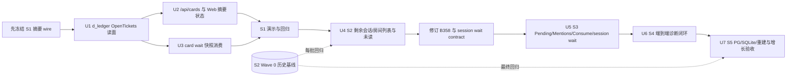

# B409 全账本读路径分域与投影性能：Breakdown 提案

> **状态：协调者审议完成（2026-09-25）；拆卡与派发尚未执行。**
> 已批准基准：[`2026-09-24-ledger-read-performance.md`](2026-09-24-ledger-read-performance.md) r2，用户批准；L3 重档。
> Wave 0：S2 房间历史首屏切片已验收通过并由 GPT-6-Sol 独立复审 PASS。被测工作树 `75c518f235b1abdda0e9156de51fd1154e39f78d`，构建 `75c518f235b1+dirty16`。本文件只规划其余工作，不代表 B409 最终验收。

## 协调者裁决

1. **S1 拆为 U1/U2/U3 三个有界工作单元**：U1 提供账本读面，U2 负责 API/Web，U3 负责 `card wait`；U1 完成后 U2/U3 可并行。三者跨 `d_ledger`、`d_gateway`/`d_web`、`d_cli`，文件集合互不重叠且每段有独立验收，拆分能缩小协作接缝；最终仍按一个 S1 故事集成验收。
2. **U4/U5 暂不新增共享 LedgerClient contract**：它们按 S2、S3 分开保持故事边界；现有证据还不能证明两个单元一定共享同一新方法。各自 plan 必须核定真实消费者；若发现两卡共同依赖新的公开 LedgerClient 方法，则该最小接缝须在首个消费者实现前回 contract 冻结。私有查询实现不另造空 contract。
3. **S1 远端摘要字段已冻结**：见 [`b409-contract.md`](b409-contract.md)。新增 `status` 与 `observed_at`，保留现有 `count/tasks/unknown_targets`；状态完整语义、30 秒门槛和消费者金样以该契约为准，U2 不得自行更改。

## 基线事实与范围解释

- Wave 0 只验了 **S2 单房间消息历史首屏**：最近 200 条、升序、房间隔离、排他游标、取消、真空与查询错误状态，以及 PG/SQLite 同金样。验收记录明确说它不代表其余故事通过。
- 批准 spec 的 S2 还包含会话/房间列表、详情、未读与汇总。它们仍是待实现/待验范围；本提案把 W0 历史切片作为已验基线，**不重复建该切片的子卡**，另列仅承接剩余列表/未读范围的工作单元。
- S1、S3、S4、S5 与 S2 剩余范围均不得借用 Wave 0 的 PASS 结论；跨故事复用代码或测试不等于故事行为闭环。
- 2026-09-23 20:00–22:00 桌面不可用的历史根因仍未证实。本期改善性能与可诊断性，不回溯冒称已解释该时段。

## 1. 触及子系统与派卡资格

按 `codegraph/best.json` 的顶层域（`parent` 为空）识别子系统；`d_web_cards`、`d_web_contract` 是 `d_web` 内部领域，不按子系统拆卡。类型按 Charter 逻辑型/边界型标注。派卡资格逐项检查：①文件集有界；②契约面可枚举；③同级依赖可排 DAG；④类型明确。

| 子系统 | 类型与责任 | 本期范围/契约面 | 派卡资格核对 |
|---|---|---|---|
| `d_ledger` 卡片账本 | 逻辑型；追加事件、可重建投影和限域持久查询的唯一所有者 | `internal/ledger/taskstate.go` 的 `OpenTickets`/`OpenTicketCounts`；`rooms.go`、会话/事件查询与相应 PG/SQLite schema/test。出面为既有 `ledger.Store` 与 B156.2 的 `LedgerClient` 提供侧 | ①按故事可限定到 task-state 或 room/inbox 查询族及其 Store/schema/test；②读接口/现有结果可枚举；③经既有依赖边可排 DAG；④ logic；四项满足。不得把房间判定或协作消费规则搬进 ledger。 |
| `d_collab` 协作房间 | 逻辑型；拥有房间、成员、未读/已读/消费与寻址语义 | `internal/collab/service.go`、`sessions.go`、`room/` 与消费侧 tests；只通过消费方定义的 `LedgerClient` 读写账本 | ①按 `History/ListSessions/ListRooms/Unread` 与 `Pending/Mentions/Consume` 函数族划界；②出面为既有 service 与 LedgerClient；③`d_collab→d_ledger` 仅接口边；④logic；四项满足。不同故事共享这些文件时须按 DAG 顺序集成或先冻共用接缝。 |
| `d_gateway` 控制门面 | 边界型；HTTP 路由/鉴权/响应编排及跨机请求 | `internal/agentd/ledgerapi.go`、`roomsapi.go`、session/inbox handler 及测试；消费者为浏览器与 CLI/agentd 客户端 | ①按 endpoint 与摘要编排划界；②HTTP JSON、status/error 形状可枚举；③既有 `d_gateway→d_ledger/d_collab/d_transport` 边；④boundary，外部目标/浏览器行为需真机；四项满足。 |
| `d_cli` 协调者命令面 | 逻辑型；将终端意图映射到账本/协作调用并维持脚本输出 | `cmd/card_wait.go`、`cmd/session.go`、`cmd/room.go` 与对应 tests；`card_snapshot`/wait 输出及 timeout/游标语义 | ①命令族文件有界；②flags、JSON stdout、exit code 可枚举；③沿既有 Store/collab/protocol 边；④logic；四项满足。 |
| `d_web` Web 控制台（含 `d_web_cards`、`d_web_contract` 等子域） | 逻辑型；呈现账本、房间与过滤操作 | `web/src/app/shell/Shell.tsx`、`board/columns.ts`、room/session 数据模型与对应 API types/tests | ①可限定到卡片摘要/会话房间列表与消费组件；②HTTP JSON 与显示状态可枚举；③HTTP 是现有 boundary 契约，不新增 Go 依赖边；④logic；四项满足。 |
| `d_transport` 跨机连接 | 边界型；提供 `targetclient.Pool` 与远端 target 请求 | S1 的 unlinked target summary 依赖它的既有调用结果；本期不改变连接/重试协议 | 作为受约束依赖满足四项资格，但没有独立实现卡；只有发现要改 target client 契约时才退回评估。真机覆盖目标可达/不可达和额度耗尽。 |

`d_protocol` 是需保护的既有契约域：保留 `CardView`、`RoomMessage`、`SessionWake`、`SessionBacklog` 等已存在形状；只有 S1 contract 决定必须变更跨进程类型时，才将其列入 S1 实际改动面。不得因“方便”在 web/collab 各造一份权威 DTO。

### 依赖图与架构边界

`codegraph/target.json` 已有 `d_gateway→d_ledger`、`d_gateway→d_collab`、`d_gateway→d_transport`，`d_cli→d_ledger` / `d_cli→d_collab`，以及 `d_collab→d_ledger` `LedgerClient` 接口。保持这些方向：ledger 负责可查询数据供给；collab 保留业务判定；gateway/CLI/Web 只消费；target summary 仍走既有 Pool；组装点不变。

S2 Wave 0 冻结的 `RoomMessagesBeforeContext` 继续为房间历史唯一限域读入口。不得为了复用强行将 `Pending`、`Unread`、task mirror 投影拼成一个万能查询；不得让 collab 直连 SQL；不得改 `EventsFromAsc`/`Store.Follow` 的全流语义或 wakeconsumer。

**图覆盖债**：批准 spec/契约台账记载 `HistoryContext`、`ReadAllEventsContext`、`ListSessionsContext`、`SessionTab`、`SessionChat`、`fetchRoomMessages` 等若干节点未入图或 `moved`；本轮 `codegraph sym` 还未命中 `Store.OpenTickets`、`Store.RoomMessagesBeforeContext`、`runSessionWait`、Shell 局部值 `unlinkedTaskIds`。这些符号已回落到源码定义处核实，见 `internal/ledger/taskstate.go:147`、`internal/ledger/rooms.go:19`、`cmd/session.go:86`、`web/src/app/shell/Shell.tsx:191`。现有可定位锚点为 `internal/ledger/taskstate.go#Store.OpenTicketCounts`、`internal/agentd/ledgerapi.go#Server.handleCardsList`、`internal/agentd/ledgerapi.go#Server.unlinkedSummary`、`internal/collab/sessions.go#Service.ListSessions`、`internal/collab/service.go#Service.ListRooms`、`internal/collab/service.go#Service.Unread`、`cmd/card_wait.go#runCardWait`、`web/src/api/ledger.ts#UnlinkedSummary`、`web/src/app/cards/CardsPage.tsx#UnlinkedRow`、`web/src/app/board/columns.ts#unlinkedOnly`。对照真源码与生产调用，不能把 `codegraph chain` 当有序调用事实。本期新增符号在 `codegraph check` 后按实际缺失记图覆盖债，不在 breakdown 中臆造节点。`codegraph validate` 的既有 B272 缺 baseline domain 与 B374 重复 container 问题不归本故事修复。

## 2. 冻结边界核对

| 适用冻结物 | 生产者 → 消费者 / 版本 | 本期约束与处理 |
|---|---|---|
| B409 r2（批准 `16498397`） | ledger Store → collab / gateway / CLI / Web；r2 | S1–S5 用户行为、三组增长数据、p95 ≤2s、摘要 freshness/筛选语义与诊断字段要求为批准基准。SQL、索引和可重建投影仍属内部实现选择。 |
| B156.2 contract §3.4.1、§3.5、A.5（`25fa5c5f`） | `LedgerClient.RoomMessagesBeforeContext` / `HistoryContext` → HTTP、CLI 与 Web；Wave 0 已使用 | S2 历史窗口为 200、`beforeSeq` 排他、升序、房间过滤、真空与错误分离、context 取消；`EventsFromAsc`/Follow 不变。A.5 旧十万行护栏已关闭。 |
| B156.2 contract §4 读面/消费冻结 | ledger `room_message`、`message_consumed` → `Pending`/`Mentions`/`Consume` 与收件箱 | S3 只能优化读取，不改未消费定义、Mentions、幂等 Consume、`room_message` kind 和既有回复后提及清理语义。 |
| B358 contract §3.8/§4.6（39–50） | 会话消息 → `session wait` 外部成员订阅 | 既有冻结规定无 `--since` 从 MaxSeq 起、事件流全扫、一次命中输出、目标精确匹配、无卡事件不进 `Store.Follow`。B409 S3 需按 r2 改为共享交付 cursor/补拉/摘要；实施前须同步修订 B358，不得只改实现。 |
| Session reliable mentions contract v1（批准 r2 的冻结） | `session send/wait` 与共享 PG/SQLite cursor → CLI listener | 正文 @ 编译、目标唯一由 `MessageWakeTargets` 判、stdout 成功即交付、cursor 单调且失败不伪装成功、积压 `session_backlog` 形状、无逐条 ack/不保证同 member 多 listener 唯一认领。S3 限域优化不得改这些承诺；更新全流读描述时同步修订该契约。 |

**需要先冻结、但目前尚未完成的增量：** S1 在新增摘要状态/时间字段前冻结精确 JSON 投影与 Web/CLI 消费断言；S3 在实现前修订 B358 与 session reliable-mentions 的旧全流描述。若 S2/S3 被拆成独立 work unit 并共同依赖新的 ledger read seam，先冻结该最小 interface。否则，单工作单元内部可逆 SQL/游标实现由 plan 决定，不制造空 contract。

## 3. 剩余工作单元与依赖 DAG

S2 Wave 0 历史切片作为基线 `B0`，在后续集成批次回归；不再列为工程卡。其余工作建议按可演示故事串行集成，减少 `ledgerapi.go`、`service.go`、`rooms.go` 的同文件并行冲突。

### U1 · S1 ledger 未决工单读模型

- **①故事/边界**：S1；沿用 B409 r2、B156.2 既有未决工单语义；供 `/api/cards` 聚合与 `card wait` 初始快照消费。
- **②意图**：停止每次把全部 `task_mirrored` payload 拉回应用再重放；账本仍以 `card_events` 为唯一真相，投影必须可幂等重建或查询可直接限域。
- **③验收**：`OpenTickets` 与 `OpenTicketCounts` 结果逐卡等价于事件重放；ticket close/answer/archive 状态正确；不相关 payload 不再传回应用；重建与重复事件不造成漏算/双算。S1 的业务输出语义不变。
- **④入口/有界文件集**：`internal/ledger/taskstate.go` 的 `OpenTickets` / `OpenTicketCounts`、`internal/ledger/store.go` schema 入口（若新增持久辅助结构）、相应 taskstate/store SQLite 与 PG 测试；任何事件写入点仅在投影方案确需同步维护时由 plan 点名，不扩成全 ledger 改造。
- **依赖/集成**：无新增 public seam 时可先实现；若 API 形状变动，先 contract。完成后供 U2/U3 使用，并演示旧读面逐条一致。

### U2 · S1 卡片 API 与远端摘要状态

- **①故事/边界**：S1；r2 远端摘要 freshness/部分成功契约及既有 CardView/API 字段。
- **②意图**：`/api/cards` 先返回本地账本事实，不同步等待所有 target；展示摘要上次观测、最新/部分/陈旧/不可用状态；只有 30 秒内完整结果能驱动当前数量和筛选。30 秒沿用当前刷新窗口，只决定摘要能否代表当前状态；陈旧观测继续带时间显示，不设隐藏期限，避免把“没有新观测”误看成“没有数据”，同时不能让旧值驱动当前数量或筛选。未知不能冒充零。
- **③验收**：新 JSON 金样锁缺失/零值差异；target 部分失败保留可读结果并列 unknown；超 30 秒显示陈旧和观测时间；全不可用与未观测为不可用而非 0；远端超时不拖慢主账本响应；Web 卡片数量/filter 仅在完整新鲜结果时启用，部分/陈旧/不可用退化为不过滤。target client/`Pool` 既有授权、超时和校验不绕过。
- **④入口/有界文件集**：`internal/agentd/ledgerapi.go` 中的 `handleCardsList` / `unlinkedSummary`、对应 handler tests；`web/src/api/ledger.ts`、`web/src/app/cards/CardsPage.tsx`、`web/src/app/shell/Shell.tsx`、`web/src/app/board/columns.ts` 与相应 tests。
- **依赖/集成**：依赖已冻结的 [`b409-contract.md`](b409-contract.md) 与 U1 读面。此单元不改 `d_transport` 协议。

### U3 · S1 card wait 建连快照

- **①故事/边界**：S1；B409 r2 与 B156.2 未决工单/等人标记现有语义；`card wait` 现有 stdout 形状。
- **②意图**：快照只取指定卡/子树需要的 open tickets 与 needs，而不全量解码全账本 mirror events。
- **③验收**：给定快照成员集合，只输出对应未决工单与等人标记；answered/closed/archive 不残留；非子树卡排除；encoding 后与当前 JSON shape 一致；构造大 unrelated mirror 集后行数/字节不随无关任务线性增长。
- **④入口/有界文件集**：`cmd/card_wait.go` 中的 `encodeCardWaitSnapshot`、`cmd/card_wait_test.go`（如文件名不同，plan 核当前测试文件）；复用 U1 ledger 读面，不在 CLI 新造账本折叠。
- **依赖/集成**：依赖 U1；与 U2 合成 S1 演示，再跑 Wave 0 `B0` 回归。

### U4 · S2 Wave 0 以外的 session/room 列表、未读与详情投影

- **①故事/边界**：S2 剩余范围；B156.2 的 `ListSessions`、`ListRooms`、member unread、last-activity、绑定/只读语义；保留已经验收的 `HistoryContext` 外部语义。
- **②意图**：列表和未读不再扫描全局事件流或为每个 room 重复扫描；session/room 业务归 collab，范围查询归 ledger。
- **③验收**：项目筛选、终态排序、last activity、member 视图、未读与 `MarkRead`/消费 cursor 投影逐一与现状金样一致；目标 room/session 隔离；错误不变空；在当前数据及 +20k unrelated 下端到端延迟达标。历史首屏用 B0 回归而非重造另一实现。
- **④入口/有界文件集**：`internal/collab/sessions.go`、`internal/collab/service.go` 的列表/Unread 函数、`internal/ledger/rooms.go` 及 ledger facade/client 对应读方法、`internal/agentd/roomsapi.go` 的 list/session handler 与 Web rooms/session 消费测试。不得越过 `LedgerClient` 读 SQL。
- **依赖/集成**：U4 与 U5 保持独立故事单元；plan 需检查它们是否真实共享新 `LedgerClient` 方法。若共享，按上方裁决先冻结最小接口；若不共享，不增加 contract。

### U5 · S3 收件箱消费与 session wait 限域恢复

- **①故事/边界**：S3；B156.2 收件箱/未读消费条款、B358 会话订阅外形、session reliable-mentions v1 共享 cursor/CLI JSON 契约。
- **②意图**：让 `Pending`、`Mentions`、`Consume`、回复后 mentions 清理和 `session wait`/`--follow` 按 room/member/cursor 范围读；保留未消费与逐字寻址事实，避免全流扫描。
- **③验收**：Pending union、Mentions 排除已消费、Consume 幂等与回复清理保持金样；wait 使用共享 `session_delivery_cursors`，从 (cursor, MaxSeq] 升序筛定向命中；backlog 汇成已冻结摘要，follow 后输出既有 SessionWake；stdout 成功后推进、故障不跳水位；`--timeout 5s` 空等 30 次每次 ≤6s，follow idle timeout 不变；CLI/JSON 用户结果与现状语义一致。
- **④入口/有界文件集**：`internal/collab/service.go` 的 Pending/Mentions/Consume/回复清理、`internal/collab/room` 消费判据、`cmd/session.go` 中的 `runSessionWait` / 发送消费入口、相应 ledger/API query 方法及测试。不得改 `internal/agentd/wakeconsumer.go`。
- **依赖/集成**：B358 与 session reliable-mentions contract 修订先通过；若 U4 独立并分享新读接口，依赖该 interface freeze 和 U4；完成后演示 wait 断线恢复，并回归 S1/S2。

### U6 · S4 可诊断读路径

- **①故事/边界**：S4；B409 r2 的连接池等待、SQL、行/字节、应用投影、远端等待、取消及端到端时间要求。日志安全要求同 Wave 0。
- **②意图**：一次慢读能区分连接获取、数据库、解码/投影、远端 target、浏览器/CLI 等待或 context cancel；载体额度状态不得阻塞本地账本读取。
- **③验收**：每类成功、空、错误、取消都有可检索阶段数据；请求级耗时闭合并能与内部 stage 对账；敏感信息测试确认不输出 DSN、凭据、消息正文或 token。target 逐台耗时/失败可辨，partial 与 stale 可追溯观测时间。
- **④入口/有界文件集**：只在 B409 读入口与已触及投影点补仪表：`internal/agentd/ledgerapi.go`、`roomsapi.go`、相关 session/room handlers、`internal/collab/service.go`、U1/U4/U5 引入的 ledger query 文件及 `cmd/session.go`；不增通用 metrics 子系统、不改无关请求族。
- **依赖/集成**：在主要路径实现稳定后收口，依赖 U1–U5 的日志埋点；敏感值脱敏已有 Wave 0 测试须回归。

### U7 · S5 方言、投影重建与增长矩阵集成验收

- **①故事/边界**：S5；PostgreSQL/SQLite 同语义、`card_events` 可重建、projection watermark/lag 无静默损坏；回归 S1–S4。
- **②意图**：性能路径不能牺牲数据正确性；不存在事务提交与派生视图永久分叉的静默窗口。
- **③验收**：同一 fixtures 两方言逐 seq/行/字节及输出 JSON 对照；旧数据升级/回填/重复回填/中途失败再恢复；事件写入与投影更新原子或具有可见补偿；建立 spec 三个数据规模且验证 seed 确为 `task_mirrored`、没有 `mirror_event` 混入；报告每个 endpoint/Web/CLI 样本分布与错误数。
- **④入口/有界文件集**：相关 ledger PG/SQLite integration tests 与 B409 隔离数据/性能 fixture；仅为覆盖投影重建改动其归属 ledger 文件，不在本单元发明第二套线上事实源。
- **依赖/集成**：依赖 U1–U6，作为父卡最终 story-set integration/acceptance 证据入口；不以该项代替各故事独立演示。

### 候选集成 DAG 与阶段演示

| 批次 | 内容 | 前置/每批回归 |
|---|---|---|
| A | U1 → U2+U3，完成并演示 S1 | S1 摘要 contract；回归 S2 Wave 0 `B0` 历史；不在远端不可达时把摘要当 0。 |
| B | U4，完成 S2 剩余列表/未读 | A；重跑 `B0`。 |
| C | B358/session-wait contract delta → U5，完成 S3 | B；S1、S2 回归；真机停听重挂与跨机共享 cursor。 |
| D | U6，完成 S4 诊断闭环 | A–C；制造隔离库错误、取消和 target 不可达状态。 |
| E | U7，完成 S5 并交完整故事集 | A–D；三增长阶段、PG/SQLite 及所有入口最终回归。 |

各实现 work unit 拟提交范围为上述有界文件集；调用方向仍按 `d_ledger→Store`、`d_collab→LedgerClient`、gateway/CLI 既有 Store/service 面，Web 走现有 HTTP JSON。若计划发现一个子卡无法圈定文件或共用 seam 未冻结，先回 breakdown/contract 修边界，不创建万能 performance card。

## 4. 五列行为闭环

| 触发者 | 权威事实/载体 | 消费者 | 可观察结果 | 实现与集成责任 |
|---|---|---|---|---|
| 用户打开工作项看板、筛选卡或启动 `card wait` | 账本 `card_events`/task mirror 与可重建 open ticket 投影；remote target 的最近观测记录单独保存 | `OpenTicketCounts`、`OpenTickets` → `/api/cards`、`card wait` → Web filter | 卡片主数据及时；快照/数量一致；未观测 target 显示未知，完整 fresh 摘要才驱动当前筛选 | U1 提供投影，U2 API/Web 和 U3 CLI；父协调者集成 S1。 |
| 用户打开/切换会话或房间并查看未读 | `card_events` 消息、会话/房间权威元数据与 member read cursor；历史使用 B156.2 limit/beforeSeq | collab session/room list/history → `/api/sessions`,`/api/rooms`/history 与 Web | 列表、未读、最近 200 条历史正确；查询错误与真空区分；不因无关 event 数增长而全量传输 | S2 历史切片由已验 B0；U4 负责列表/未读剩余和最终 S2 回归。 |
| 外部 agent 有待办/提及、回复或重挂 session listener | `room_message`、`message_consumed`、绑定关系和 `session_delivery_cursors` | collab Pending/Mentions/Consume，回复清理；CLI `session wait/--follow` | 只读到成员可消费项目；消费幂等；断线积压按 r2 摘要补出，stdout 交付后按共享水位避免重复 | U5 + S3 contract delta；最终验收负责人核真实 CLI/PG 路径。 |
| DB/连接池/目标/客户端发生慢、失败或取消 | request/context、DB stage/row/bytes、target observation time 与结果 | agentd/collab/ledger structured logs 与 API/UI 摘要状态 | 能区分慢在何处、部分成功与取消；日志不含凭据/正文；本地账本结果不被远端不可达阻塞 | U6；协调者注入隔离故障并核 stage 数值与实际端到端时长。 |
| 数据跨 PG/SQLite 建库、升级、重建或读取 | `card_events` 追加权威和 projection seq watermark | 两方言 ledger Store 与上层同一 collab/CLI/API | 逐项结果等价；重建不丢、不重；投影落后可见并可恢复 | U7 + 各实现单元的回归；协调者最终 acceptance 核全部故事。 |

## 5. 缺陷族风险与验收闸

| 缺陷族 | B409 对抗问题与责任落点 |
|---|---|
| 生命周期 / 状态机中断 | U1/U7：进程在事件 commit 与投影推进之间崩溃会不会漏算/重复？以同事务更新，或明确 watermark、重放与恢复；重复回填幂等。U5：stdout 成功而 cursor 未写可重投，cursor 不得先行。取消必须终止 SQL/扫描；target 超时必须收尾。 |
| 静默失败 / 误导报错 | U2/U4/U6：数据库/查询/连接池失败不能伪装空卡、零工单/零摘要；部分 target 失败列明未知；缓存超 30 秒变陈旧；API 主数据失败需错误响应。DSN/payload 脱敏有 Wave 0 新鲜红测。 |
| 跨平台假设 | U7：PG/SQLite 的排序、JSON 提取、upsert/事务、空与零值、时间戳语义同构。真实 machine CLI/agentd Mac/Linux 路径区别报告；不能以 Docker PG 单测推断远端 agentd 配置正确。 |
| 假红 / 假绿测试 | 使用真实 `task_mirrored` payload，不把 `mirror_event` 夹具冒充；记录精确种子行数/字节；HTTP/浏览器端到端与 Store 指标分开；`/rooms` 实际不是页面路由，浏览器用会话工作区实际路由 `/` 与 `/cards`。每个行为断言有 §6 对应真机项。 |
| 门禁绕过 | 所有消费/回复写路径仍过 collab 及 ledger 原有权限、writer、idempotence 门；优化只改读。远端摘要沿既有 Pool 和每 target timeout，不能为了 p95 绕过 target 权限/身份校验；迁移只作用隔离数据库。 |
| 序列化边界 | S1 摘要从 gateway JSON 到 Web API type/角标/filter 全链断言；open-ticket count 与 card snapshot 必须在 ledger→gateway/CLI 序列化边界比对。S3 backlog/SessionWake stdout JSON 复用已冻结样本。缺失字段与零值用可空字段断言区分。 |
| 枚举新值通过既有白名单 | S1 freshness 状态及 S4 stale/partial 取值全链登记到 Go/TS 校验与 switch；不要复用 event kind。task mirror 终态集合沿既有 enum；所有入口验证新鲜状态分支。 |
| 承重安全属性 | Projection 唯一性、watermark 单调、member isolation、cursor only-after-stdout、业务消费幂等均要有能变红测试。已达旧序号的投影不可倒退；并行写 race 核同事务/CAS。 |

## 6. 真机与环境验证清单

未完成下列条目的行为事实标记为 **「未验证，需真机」**。Wave 0 只销 S2 历史切片对应项目，不销整节。

1. **S1 卡片端到端**：真实 `/api/cards`、Web 卡片列表/filter 与 `card wait` snapshot 核对 `OpenTickets`、计数、needs；当所有载体额度耗尽/target 不可达时主账本仍快速可见，摘要状态分别覆盖未观测、部分、完整新鲜、超过 30s 陈旧；仅新鲜完整状态可筛选/计数。未观测不能呈现为合法零。
2. **S2 Wave 0 基线（已验证）**：验收库 `handoff_b409_ui_recheck`、50,609 events/18,674 `task_mirrored`、200 条 seq `341874–342073`，浏览器三阶段 p95=436/435/496ms、HTTP p95 与取消/真空/失败语义见接受 ledger；复用该证据，不重新建历史工作单元。**S2 剩余列表/未读仍未验证，需真机**：会话/房间列表、member unread、项目筛选、切换房间及详情错误分支，基准规模与 +20k unrelated 数据实际走 `/` 会话工作区与 API。
3. **S3 消费/等待**：真实 CLI `Pending/Mentions/Consume` 与 reply 清理；有效/无效 @、已消费、重试与超时；共享 PG 写定向消息后停止 listener，在另一机器重挂补出，重复重挂无重复；follow 空闲 timeout；30 次 `session wait --timeout 5s` 每次 ≤6s。验收确认 CLI 实际读的是同一个 PG DSN，防配置解析失败后静默落 SQLite。
4. **S4 诊断闭环**：隔离 PG 注入 SQL 延迟/错误、锁等待、连接不可用、cancel、target 单点/全体超时；分别核日志阶段耗时、行数/字节与 HTTP/CLI 可见结果；日志扫描不得含 DSN/口令/消息正文/token。
5. **S5 方言/投影**：隔离 PG 与 SQLite 同一组事件 golden；升级旧库、重建/重复重建、投影半途失败后重试；PG 的三档数据集（约 21,270 events；+≥20k 无关事件；再将镜像行数与 payload bytes 翻倍），确认真实 `task_mirrored` 数量/字节，分别执行 5 次预热+100 次串行 HTTP 样本并计失败；Store/HTTP/Web `/cards` 与会话工作区 `/` 的 p50/p95/max 均按 spec 报告，目标 p95 ≤2s，首请求单列。远端运行链路与本机隔离库结果分开报。
6. **最终真机部署与验收**：B409 卡记录 seq 21326 明确记载用户已授权本机与 `linux-01` 更新部署，UI 验收不经 SuperDev。Wave 0 使用隔离验收 agentd，未部署 `linux-01`；本拆解阶段也不执行部署。父卡 S1–S5 故事证据齐备后，在最终真机 acceptance 阶段按该授权核当前 build/健康并验证用户会话页面。环境连接、服务版本、容器/数据库清理和真实账本身份写入 acceptance 记录。

**仍未证实/需诚实表述**：剩余 S1、S2 列表/未读、S3、S4 与 S5 的最终故事行为和全矩阵性能；生产 20:00–22:00 历史故障的具体根因；Tailscale/池等待各自对端到端耗时的比例；未在真机跑过的平台。S2 Wave 0 证明的是单房间历史切片，不可外推为以上任一条通过。

## 出稿自检

- 四项均有：按 best 图的子系统/类型及第一条四条件、既有冻结物与所需 contract 增量、S1–S5 工作单元/DAG 与五列行为闭环、缺陷族风险和复核判据。
- 协调者裁决集中在稿首；S1 JSON wire 有独立冻结文件；不把尚未查实的 S2/S3 共享 interface 暗中冻结。
- S2 Wave 0 基线有明确来源/结果/回归负责人，已验切片无重复子卡；S2 的 spec 剩余面单列工作单元。
- 全部未证行为列入真机清单并标「未验证，需真机」；性能样本与真机用户路径分列。
- 工作单元均列路径边界、依赖与可复核验收；若拟拆卡后共享缝仍未冻结，停止于 contract，而非让各卡自行造接口。
